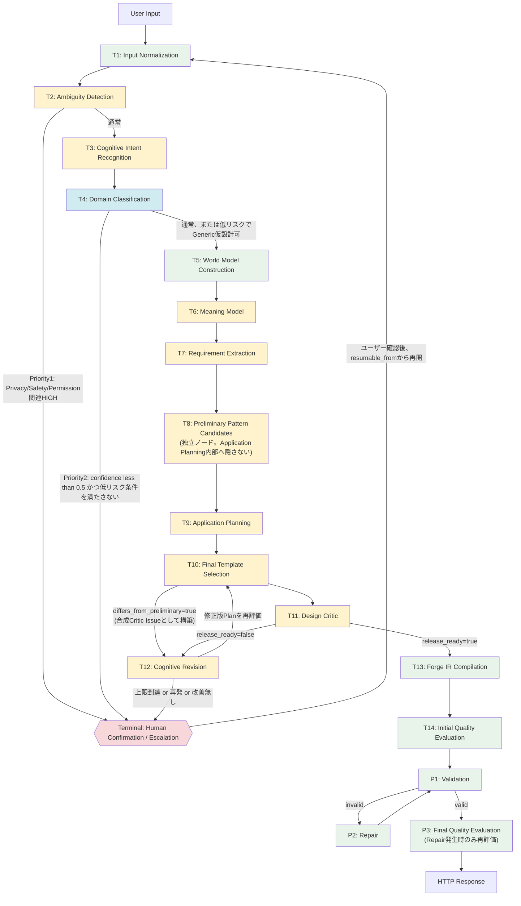

# Diagram 1: Cognitive Pipeline

`docs/spec/FORGE_COGNITIVE_ARCHITECTURE_V2.md` 3章、
`docs/spec/FORGE_M007_IMPLEMENTATION_BLUEPRINT.md` Task3.3に対応。

**段階数の確定(2026-07-15、CEO実物監査(4回目)により確定)**: 「全16
段階」という表記は撤回した。Transformation Stage(T、実際にデータを
変換する処理)・Terminal Outcome(到達すると実行が終わる着地点)・
M005 Post-processing Stage(P、`run_cognitive_pipeline()`の外側で
M005が実行する処理)という3種類を、ノードのラベルに直接反映した
(以前は1〜17の通し番号のみで、種類の違いが読み取れなかった)。

凡例: T1〜T14=Transformation Stage(M004、`run_cognitive_pipeline()`
の内部)、Terminal=Human Confirmation/Escalation(到達すると実行が
終わる)、P1〜P3=M005 Post-processing Stage(`run_cognitive_pipeline()`
の外側、既存`PromptPipeline`が実行)。色は緑=Deterministic中心、
黄=Hybrid、青=Rule+LLM fallback(M006 13章のLLM使用方針と対応)、
赤=Human Confirmation/Escalation(複数の到達元を持つ、M006 4.3節の
優先順位で判定)。

**再計画の統一(CEO実物監査(4回目)対応)**: Final Template Selection
(T10)がPreliminary候補(T8)と著しく異なった場合、以前は
Application Planning(T9)を同じ入力で再実行する矢印を描いていたが、
決定的な実装であれば同じPlanが再生成されるだけで無意味である。
本図では`J -->|差異あり| L`とし、Cognitive Revision(T12)が
「合成Critic Issue」として不一致を受け取り、Planを更新する経路へ
統一した。

**二重ループ防止の可視化**: `J -->|差異あり| L`(Final Template
Selectionから Cognitive Revisionへ)と`K -->|release_ready=false| L`
(Design CriticからCognitive Revisionへ)は、**同じ試行回数カウンタ・
上限を共有する**(ADR-008、M006 12.4節)。Schema Repair(P2、既存M005)
とは完全に独立させる。
