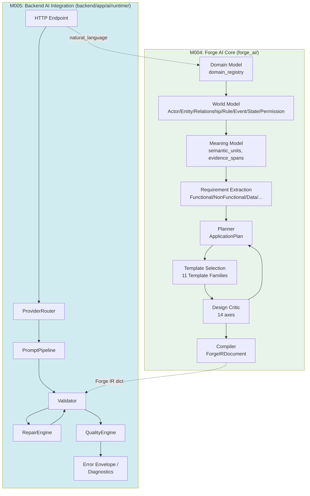

# Diagram 2: Module Responsibility

```mermaid
graph TB
    subgraph M004["M004: Forge AI Core (forge_ai/)"]
        direction TB
        DM[Domain Model<br/>domain_registry] --> WM[World Model<br/>Actor/Entity/Relationship/Rule/Event/State/Permission]
        WM --> MM[Meaning Model<br/>semantic_units, evidence_spans]
        MM --> RE[Requirement Extraction<br/>Functional/NonFunctional/Data/...]
        RE --> PL[Planner<br/>ApplicationPlan]
        PL --> TS[Template Selection<br/>11 Template Families]
        TS --> DC[Design Critic<br/>14 axes]
        DC --> PL
        DC --> CO[Compiler<br/>ForgeIRDocument]
    end

    subgraph M005["M005: Backend AI Integration (backend/app/ai/runtime/)"]
        direction TB
        HTTP[HTTP Endpoint] --> PR[ProviderRouter]
        PR --> PP[PromptPipeline]
        PP --> VA[Validator]
        VA --> RP[RepairEngine]
        RP --> VA
        VA --> QE[QualityEngine]
        QE --> ER[Error Envelope /<br/>Diagnostics]
    end

    HTTP -.->|natural_language| DM
    CO -.->|Forge IR dict| VA

    style M004 fill:#e8f4ea
    style M005 fill:#d1ecf1
```

M004内部(緑)がM006で強化する範囲。M005(青)は変更しない
(18章「M004/M005との責務境界」)。
