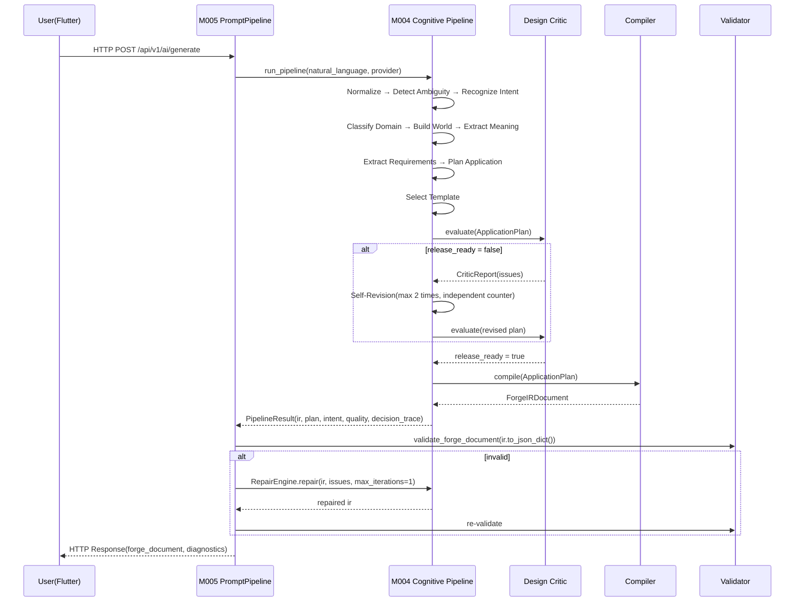

# Diagram 3: Runtime Call Sequence

```mermaid
sequenceDiagram
    participant U as User(Flutter)
    participant M5 as M005 PromptPipeline
    participant M4 as M004 Cognitive Pipeline
    participant CR as Design Critic
    participant CO as Compiler
    participant VA as Validator

    U->>M5: HTTP POST /api/v1/ai/generate
    M5->>M4: run_pipeline(natural_language, provider)
    M4->>M4: Normalize → Detect Ambiguity → Recognize Intent
    M4->>M4: Classify Domain → Build World → Extract Meaning
    M4->>M4: Extract Requirements → Plan Application
    M4->>M4: Select Template
    M4->>CR: evaluate(ApplicationPlan)
    alt release_ready = false
        CR-->>M4: CriticReport(issues)
        M4->>M4: Self-Revision(max 2 times, independent counter)
        M4->>CR: evaluate(revised plan)
    end
    CR-->>M4: release_ready = true
    M4->>CO: compile(ApplicationPlan)
    CO-->>M4: ForgeIRDocument
    M4-->>M5: PipelineResult(ir, plan, intent, quality, decision_trace)
    M5->>VA: validate_forge_document(ir.to_json_dict())
    alt invalid
        M5->>M4: RepairEngine.repair(ir, issues, max_iterations=1)
        M4-->>M5: repaired ir
        M5->>VA: re-validate
    end
    M5-->>U: HTTP Response(forge_document, diagnostics)
```

M004内のSelf-Revision LoopとM005のSchema Repair Loopが、それぞれ
独立したカウンタを持つことを図示している(ADR-004)。
