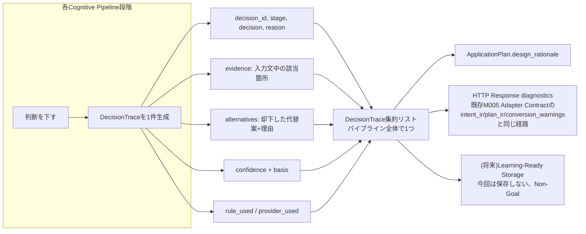

# Diagram 4: Decision Trace Flow

```mermaid
flowchart LR
    subgraph Stage["各Cognitive Pipeline段階"]
        D[判断を下す] --> T[DecisionTraceを1件生成]
    end
    T --> L[decision_id, stage, decision, reason]
    T --> E[evidence: 入力文中の該当箇所]
    T --> A[alternatives: 却下した代替案+理由]
    T --> C[confidence + basis]
    T --> R[rule_used / provider_used]

    L --> AGG[DecisionTrace集約リスト<br/>パイプライン全体で1つ]
    E --> AGG
    A --> AGG
    C --> AGG
    R --> AGG

    AGG --> PLAN[ApplicationPlan.design_rationale]
    AGG --> DIAG[HTTP Response diagnostics<br/>既存M005 Adapter Contractの<br/>intent_ir/plan_ir/conversion_warningsと同じ経路]
    AGG --> FUT["(将来)Learning-Ready Storage<br/>今回は保存しない、Non-Goal"]
```

15章(Explainability Record)に対応。
