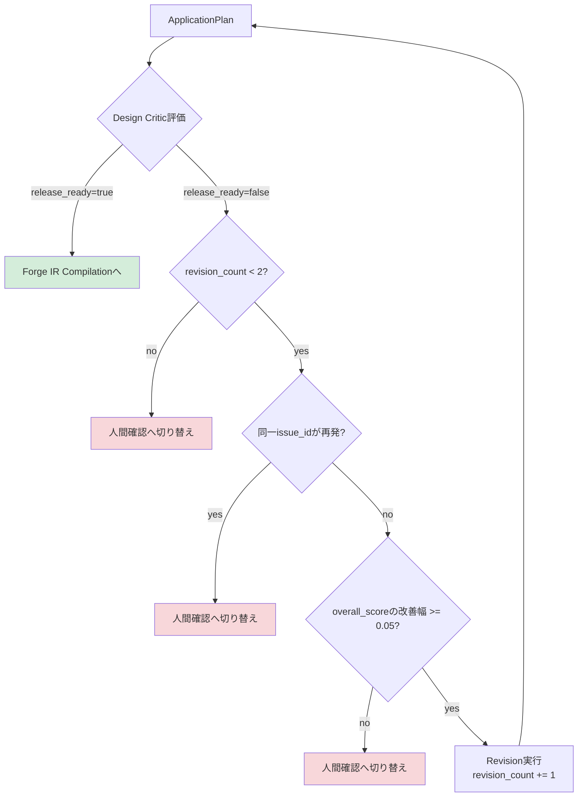

# Diagram 5: Revision Loop(Cognitive、Schema Repairとは別カウンタ）

12章(Self-Revision Loop)に対応。3つの停止条件(最大回数・再発検出・
スコア改善なし)のいずれかで、無限ループにならず人間確認へ切り替わる
ことを図示している(17.12節「Revision無限ループ」への対策)。

**2026-07-15追記(CEO監査対応)**: `revision_count`は、本図が示す
Critic起因のRevisionだけでなく、**Final Template Selectionが
Preliminary候補と著しく異なった場合のApplication Planning再計画
(図7・ADR-008)でも同じカウンタを消費する。** 2つの異なるきっかけ
(Critic起因/Template差異起因)が、同じ`revision_count`・同じ上限(2回)を
共有することで、Planning⇔Template Selectionという3つ目の潜在ループが
Cognitive Revision⇔Schema Repairの二重ループ問題(D59)と同種の問題を
起こさないようにしている。
