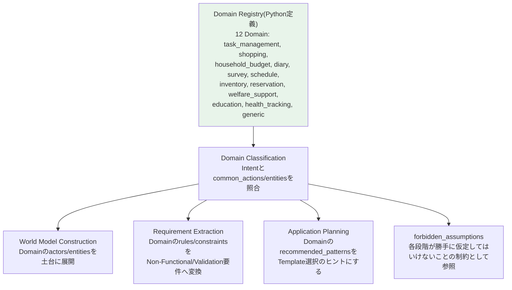

# Diagram 6: Domain Knowledge Flow

```mermaid
flowchart TD
    REG["Domain Registry(Python定義)<br/>12 Domain: task_management, shopping,<br/>household_budget, diary, survey, schedule,<br/>inventory, reservation, welfare_support,<br/>education, health_tracking, generic"]

    REG --> DC[Domain Classification<br/>Intentとcommon_actions/entitiesを照合]
    DC --> WMB["World Model Construction<br/>Domainのactors/entitiesを土台に展開"]
    DC --> REB["Requirement Extraction<br/>Domainのrules/constraintsを<br/>Non-Functional/Validation要件へ変換"]
    DC --> PLB["Application Planning<br/>Domainのrecommended_patternsを<br/>Template選択のヒントにする"]
    DC --> FAB["forbidden_assumptions<br/>各段階が勝手に仮定してはいけないことの制約として参照"]

    style REG fill:#e8f4ea
```

5章(Domain Model)に対応。Domain Registryが単なるラベルではなく、
複数の下流段階(World/Requirement/Planning)へ構造化された情報を
供給する「単一の情報源」であることを図示している。
