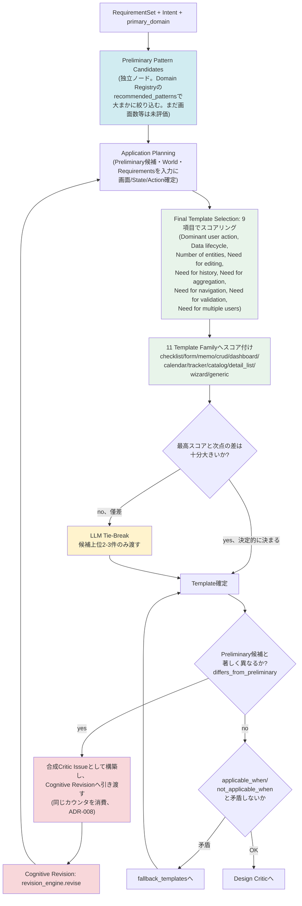

# Diagram 7: Template Selection Flow(2026-07-15、FORGE-MILESTONE-007
PREPARATION CEO実物監査(3回目)により、Preliminaryを独立ノードへ再修正）

**2026-07-15追記**: 当初、Preliminary Pattern CandidatesをApplication
Planningの内部フェーズとして図示していたが、CEOの実物監査により
「Application Planner内部へ隠すことを禁止する」と指摘され、独立した
可視のノードとして描き直した(ADR-008の該当箇所も参照)。

10章(Template Selection、= Final Template Selection)・3.8節
(Application Planning)・ADR-008に対応。決定的スコアリングが常に
先に走り、LLMは僅差の場合のみ限定的な情報で呼ばれることを図示している
(ADR-003 Rule Before Prompt)。**再計画(赤色ノード)は独立した新しい
ループではなく、Cognitive Revision(図5参照)と同じ試行回数カウンタを
共有する(ADR-008、12.4節「二重ループ防止」の対象拡張)。**
