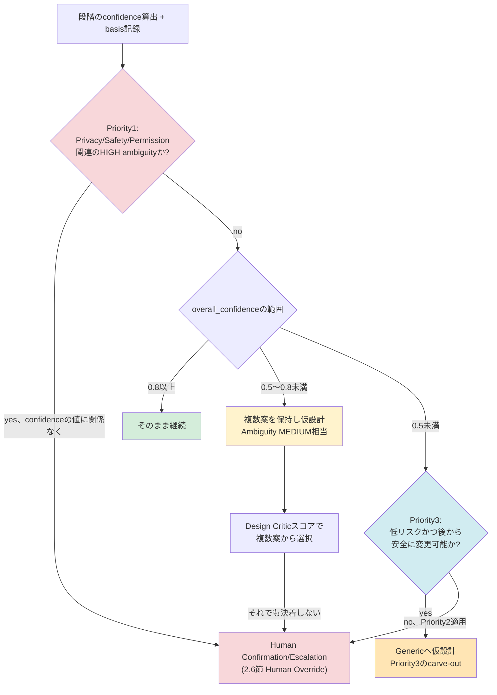

# Diagram 8: Confidence Escalation Flow(CEO監査により優先順位を統一、2026-07-15）

以前は「confidence 0.3〜0.5未満はGenericへ」(本図)と「Domain
confidence 0.5未満はHIGH(確認)」(4.3節)が0.3〜0.5の範囲で矛盾して
いた。4.3節の3段階優先順位を必ず先に評価し、その後にconfidence帯を
見る、という順序へ統一した(0.3という閾値は廃止)。

14章(Confidence Model)・4.3節(Ambiguity Detectionの優先順位)・
ADR-007に対応。**Priority1(Privacy/Safety/Permission)は
confidenceの値を一切見ずに最優先で評価される**点が、以前の図との
最大の違いである。0.5未満の場合も、無条件でGenericへ落ちるのではなく、
Priority3(低リスクかつ安全に変更可能)のcarve-outを満たさない限り
確認要求(ASK)へ進む。
