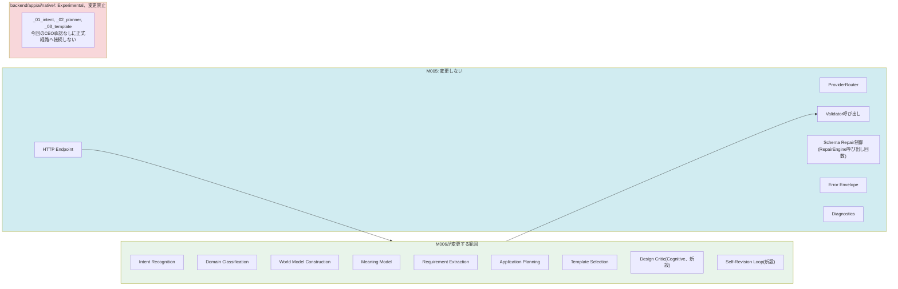

# Diagram 9: M004 / M005 Boundary

```mermaid
graph LR
    subgraph M006scope["M006が変更する範囲"]
        direction TB
        A1[Intent Recognition]
        A2[Domain Classification]
        A3[World Model Construction]
        A4[Meaning Model]
        A5[Requirement Extraction]
        A6[Application Planning]
        A7[Template Selection]
        A8["Design Critic(Cognitive、新設)"]
        A9["Self-Revision Loop(新設)"]
    end

    subgraph M005fixed["M005: 変更しない"]
        direction TB
        B1[HTTP Endpoint]
        B2[ProviderRouter]
        B3["Validator呼び出し"]
        B4["Schema Repair制御<br/>(RepairEngine呼び出し回数)"]
        B5[Error Envelope]
        B6[Diagnostics]
    end

    subgraph NativeExp["backend/app/ai/native/: Experimental、変更禁止"]
        N1["_01_intent, _02_planner, _03_template<br/>今回のCEO承認なしに正式経路へ接続しない"]
    end

    B1 --> M006scope
    M006scope --> B3

    style M006scope fill:#e8f4ea
    style M005fixed fill:#d1ecf1
    style NativeExp fill:#f8d7da
```

18章・19章(責務境界・Nativeディレクトリの扱い)に対応。
