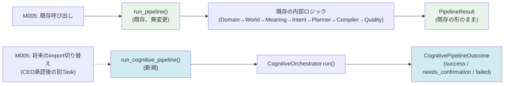
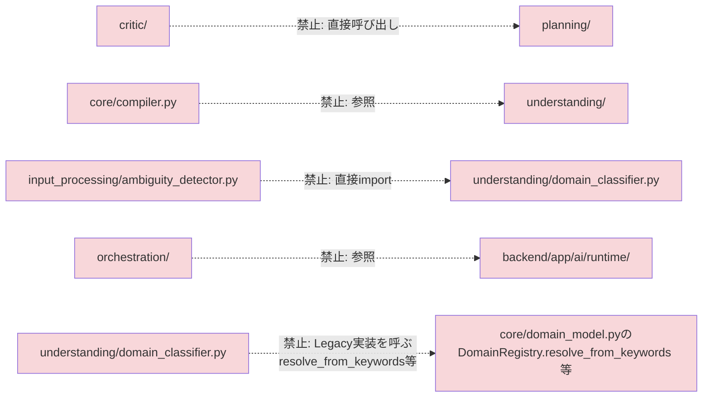

# Diagram 10: M007 Dependency Graph

`docs/spec/FORGE_M007_IMPLEMENTATION_BLUEPRINT.md` Task5に対応。

## 0. 2つの独立したFacade(CEO実物監査対応、ADR-009)



**`run_pipeline()`と`run_cognitive_pipeline()`は、コード上完全に別の
関数であり、Boolean引数で1つの関数が分岐するわけではない
(ADR-009)。** 以下の図は、`run_cognitive_pipeline()`が呼び出す
`CognitiveOrchestrator`以降の内部構造を示す。

```mermaid
flowchart TB
    subgraph ORCH["orchestration/ (唯一の制御点)"]
        CTX[cognitive_context.py]
        DEP[cognitive_dependencies.py]
        OUT[outcomes.py]
        ERR[errors.py]
        ORC[pipeline_orchestrator.py]
    end

    subgraph IP["input_processing/"]
        NORM[normalizer.py]
        AMB[ambiguity_detector.py]
    end

    subgraph UND["understanding/"]
        DOM[domain_classifier.py]
        WLD[world_builder.py]
        MNG[meaning_extractor.py]
        INT[intent_recognizer.py]
        REQ[requirement_extractor.py]
    end

    subgraph PLN["planning/"]
        APP[application_planner.py]
        TPL[template_selector.py]
    end

    subgraph CRT["critic/"]
        DES[design_critic.py]
        REV[revision_engine.py]
    end

    subgraph CNF["confirmation/"]
        ESC[escalation_handler.py]
    end

    subgraph CORE["core/ (既存、無移動)"]
        DM[domain_model.py]
        WM[world_model.py]
        MM[meaning_model.py]
        IM[intent_model.py]
        PL[planner.py]
        CP[compiler.py]
    end

    ORC -->|呼び出す(Protocol経由)| IP
    ORC -->|呼び出す| UND
    ORC -->|呼び出す| PLN
    ORC -->|呼び出す| CRT
    ORC -->|呼び出す| CNF
    ORC --> CTX
    ORC --> DEP
    ORC --> OUT
    ORC --> ERR

    IP -.->|データ型を利用、Domain Registry参照| CORE
    UND -.->|既存ロジックを薄くラップ| CORE
    PLN -.->|既存Plannerを薄くラップ| CORE
    CRT -.->|ApplicationPlanをデータとして参照のみ| CORE

    CORE -->|依存| PROV[provider/ prompt/ contracts/]

    style ORC fill:#d1ecf1
    style CORE fill:#e8f4ea
```

## 明示的に禁止される矢印(存在してはならないimport)



同階層モジュール間(`input_processing/`・`understanding/`・
`planning/`・`critic/`・`confirmation/`の相互)の直接importは、
`ambiguity_detector.py → domain_classifier.py`を代表例として図示したが、
同じ規則が全ての同階層ペアに適用される。

**CEO実物監査(3回目)による追加(Task5.2)**: `understanding/`・
`planning/`配下のCognitive実装は、`core/*.py`から**データ型定義のみ**
(`Intent`・`Domain`・`World`等のdataclass)をimportしてよいが、Legacy
Protocol実装クラス(`IntentBuilder`・`DomainRegistry.
resolve_from_keywords()`・`WorldModelBuilder`・`MeaningExtractor`・
`Planner`)のインスタンス化・メソッド呼び出しは行わない。
