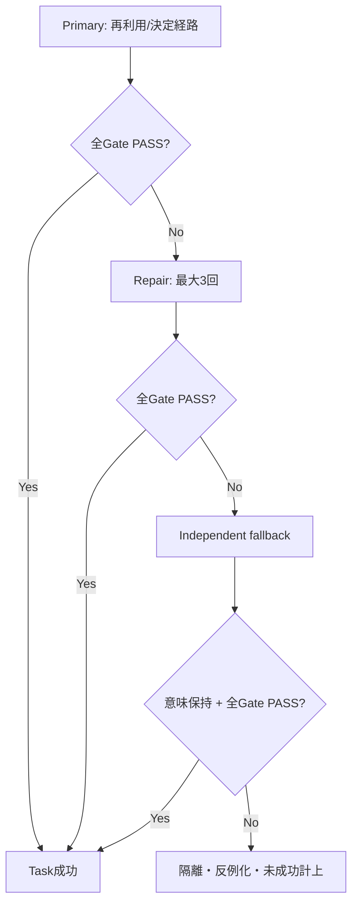
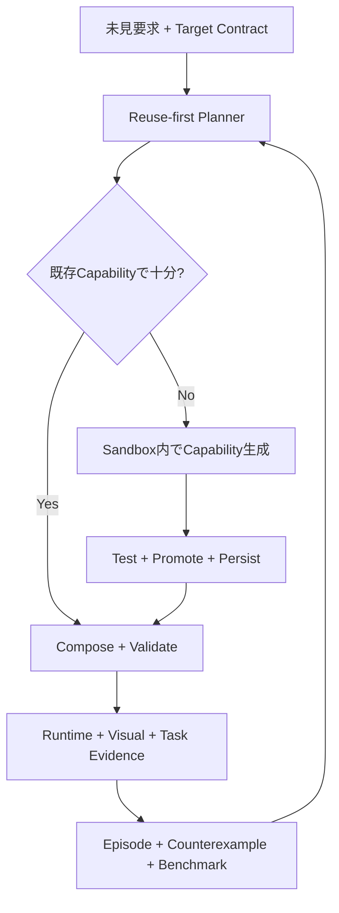

# Forge 0円・能力差0・全体成功率99% 戦略

**副題:** Zero-Budget Observable-Parity Plan（追加資金0円で、観測可能な性能・能力差を0にする計画）  
**作成日:** 2026-09-02  
**対象Repository:** `hs9cghkmpw-alt/forge`  
**対象Branch:** `claude/forge-master-handoff-k46jns`  
**調査時HEAD:** `364f8710b39497a26372f31d21486fa35a19b422`  
**資金制約:** 新規の現金支出 **0円**  
**文書状態:** **DESIGNED（設計完了）**。実装完了や能力差0の達成を先取りしていない。  
**疑義審査:** **256件**。すべてに改善策と閉鎖証拠を割り当てた。未処理の設計疑義は0件。実装上の未達は本文に残している。  
**改訂:** **v3 / All-Items 99% Outcome Architecture**。最終End-to-End、各Benchmark Slice、12 Target Contract、10大分類、121詳細能力のすべてを個別99%以上へ統一した。

---

## 0. 結論

追加資金0円のまま、性能・能力差0と、**全121詳細能力それぞれの最終成功率99%以上**を同時目標にする。ここで99%とは、Modelの初回回答率ではない。Primary（本経路）→Verifier（検証）→Repair（自動修復）→意味を落とさないFallback（代替実装）までを通した後に、利用者が目的を達成した割合の95%信頼下限である。

12項目を個別に99%へ置くだけでは全体99%にならない。独立だと仮定しても \(0.99^{12}\approx88.6\%\) である。本計画は、12項目を別々の確率として掛けず、**同じEnd-to-End Episodeが全Hard Gateを同時通過した時だけ1成功**と数える。安全性、意味保持、データ保全、未検証Promotionは99%へ緩和せず、違反0件を維持する。

方法は、2億円で購入する予定だった**人員数、GPU台数、クラウド量、端末台数**を真似ることではない。それらが生むはずだった**利用者の結果**を、次の置換で同じ合格線まで持っていくことである。

1. 人数を **Automation（自動化）・直列化・再利用**へ置き換える。
2. 高価なModel（AIモデル）の常用を **Reuse-first（既存能力を先に使う）・小型Local Model・構造化出力・道具利用**へ置き換える。
3. GPU購入を **学習を最後に回す設計、RAG（必要な知識を検索して渡す仕組み）、Skill、Compiler、検証器**へ置き換える。
4. Device Lab（端末試験室）を **公開CI、無償物理端末枠、既存端末、署名付き分散実行証拠**へ置き換える。
5. 大人数QAを **Property-based Test（性質から大量生成する試験）、Metamorphic Test（言い換えても意味が変わらない試験）、Fuzzing（異常入力の自動探索）、Mutation Test（配線を壊して検出力を確かめる試験）**へ置き換える。
6. 有料Security Audit（安全性監査）を、公開標準、Code Scanning、自動攻撃試験、公開レビュー、再現可能な証拠へ置き換える。
7. Cloud Account / Sync（中央アカウント・同期）を、Local-first（端末を正本にする方式）、Device Key（端末鍵）、暗号化同期Bundle、LAN/P2P、利用者所有Storageへ置き換える。
8. 有料配布基盤を、PWA（ブラウザから導入できるアプリ）、Self-contained Bundle（必要物を同梱した配布物）、GitHub Release、Artifact Attestation（成果物の出所証明）へ置き換える。
9. 初回生成率を成功率と呼ばず、**検証・修復・再試行・安全な代替経路を含む最終Task成功率**を99%以上へ上げる。
10. 単一経路へ99%を期待せず、異なるFailure Mode（失敗原因）を持つ二経路とRollbackを用意する。

資金が主に短縮するのは**Calendar Time（完成までの暦時間）**である。本計画では、完成時の能力を下げず、時間を可変資源として扱う。したがって、資金0を理由に機能を削らない。

### 0.1 添付されたForge構想との対応

添付資料の中心は「話す→理解する→考える→作る→届ける」と、`Space / Forming / Held` である。本計画ではこれを飾りの概念にせず、検証可能な責務へ変換する。

| 構想 | 本計画での実体 | 証拠 |
|---|---|---|
| 話す | Conversation、ASK/BUILD、Stateful Correction | 会話Task、不要質問率、意味保持 |
| 理解する | Semantic IR、Goal/Field/Constraint/Risk | 10,000未見要求、Metamorphic equivalence |
| 考える | Capability Plan、Gap検出、Route選択 | Plan trace、既知なら生成0、未知なら正確なGap |
| 作る | Compiler、Self-extension、Sandbox、Repair | Build/Runtime/Task/Security Evidence |
| 届ける | Bundle、PWA、Update、Backup、Sync | Clean-machineと実利用者Task |
| Space（可能性の空間） | Capability Catalog、Runtime Primitive、Local Knowledge | Catalog coverageとCompatibility |
| Forming（形にする過程） | 会話→Contract→Plan→生成→修復 | Generation EpisodeとStage timing |
| Held（保たれるもの） | Validator、Trust、Persistence、Reuse、Evidence | Digest、Promotion、Restart reuse、Rollback |

また、詳細Roadmapの「Conversation is the product」「Capability ≠ Widget」「自由と精密さ・安全性を同時に守る」を、TC-01、TC-03、TC-09とHard Gateへ直接入れている。

### 0.2 CEO方針のUniversal Quality Invariant（全員同一品質の不変条件）

この計画では、利用者のPC、GPU、RAM、OS、端末、無料・有料、Local・別Hostを
**品質Tier（品質の階層）にしない**。同じ要求と合意済みScope（作る範囲）には、
全員へ同じ Product Quality Contract（製品品質の合格基準）を適用する。

| 変えてよいもの | 変えてはならないもの |
|---|---|
| 内部Runtime、実行場所、処理分割、Queue、Cache、消費電力、公開上限内の待ち時間 | 意味理解、機能、生成物、Design、安全性、Privacy、Reliability、Accessibility、保存性、Evidence基準 |
| 利用量、同時実行数、追加の高度Capability | 提供対象となった同一Taskの成功率と品質下限 |

低資源端末では Execution Resolver（実行経路の選択機構）が、Reuse、CPU最適化、
分割実行、または利用者が許可した別のExecution Hostを選ぶ。低品質Model、機能削除、
粗いDesign、弱い安全基準へ自動的に切り替えない。高性能端末は同じ品質へ速く到達
し得るが、より高品質な別製品を受け取るわけではない。

「最小限の道具から始める」は、利用者とScopeを合意して小さく始める意味であり、
品質を下げる意味ではない。合意した小さなScopeでも、全Hard Gateを満たす。
要求された意味を黙って削った結果は成功として扱わない。

---

## 1. 先に修正する比較の誤差

以前の「現在46.8、2億円版94.5」は、現在のRepository証拠から作った**成熟度推定**であり、2億円版という実在Binary（実行可能製品）を測った値ではない。存在しないBinaryとは実測比較できないため、その点数を追いかけると「差0に見える採点」を作れてしまう。

そこで比較対象を次へ固定する。

> **同じ未知要求と同じ合意済みScopeに対し、端末条件や実行経路が違っても、同じ安全・機能・Design・信頼性・Accessibility基準で、公開時間上限内に利用者が目的を達成できるか。**

これを **Target Contract（目標合格契約）** と呼ぶ。資金、人員、Model名、Cloud利用量は入力条件であり、採点項目ではない。Target Contractをすべて満たした時だけ能力差0とする。

### 1.1 0円の厳密な意味

| 項目 | 扱い |
|---|---|
| 新しい有料API、Cloud契約、GPU、PC、端末、証明書、外注 | **使用しない** |
| 現在所有しているPC・端末・回線 | 使用する |
| 現在すでに利用可能なCodex/ChatGPT等 | 使用できるが、製品Runtimeの必須依存にしない |
| OSS（Open Source Software、公開ソフトウェア） | License検査後に使用する |
| 公開Repository向け無償CI | 使用するが、消滅時の代替経路を持つ |
| 無償枠 | 補助加速器として使う。製品の正しさを依存させない |
| 人の時間 | 主な可変資源として使う |
| 利用者データ | 明示同意なしに学習へ使わない |

`0円` は「電気も回線も時間も存在しない」という意味ではなく、**この計画のための追加現金支出が0円**という意味に固定する。ここを曖昧にすると、あとから有料依存を紛れ込ませられるためである。

---

## 2. 差0の数学的な判定

能力項目の集合を \(C\)、項目 \(i\) のTarget Contractを \(T_i\)、Forgeの保守的な実測値を \(L_i\) とする。確率的な項目では点推定ではなく、95% Confidence Lower Bound（95%信頼下限）を \(L_i\) に使う。

\[
g_i = \max(0, T_i - L_i)
\]

\[
G = \max_{i \in C} g_i
\]

**能力差0の定義は \(G=0\)** である。平均点では判定しない。安全性100点、同期0点を平均して合格にする逃げ道を塞ぐため、全項目の最大不足を使う。

さらに、次のHard Gate（絶対条件）は平均や信頼区間で緩和しない。

- 必須Semantic（意味）を別物へすり替えた成功: **0件**
- P0/P1 Security（重大・高危険な安全性問題）: **0件**
- 未検証Capability（獲得能力）のPromotion（本採用）: **0件**
- データ破損後に復元できない事例: **0件**
- 未計測をPASSにした項目: **0件**
- 利用者に知らせずCapabilityを消した事例: **0件**
- Hardware / OS / Device / Model / Execution Hostによる品質Gate差: **0件**
- 無料・有料で同一提供Taskの品質Gateを変えた事例: **0件**
- 合意済みScopeを端末都合で無断縮小した事例: **0件**
- 音声/文字、Mobile/Tablet/Desktop/WebでCore UXを欠落させた事例: **0件**
- 押せるが動かないControl、偽の完了説明、古い状態からの再生成: **0件**

### 2.1 全体成功率99%の判定

対象範囲内Episode集合を \(E\)、Episode \(e\) の必須意味を保った最終Task達成を \(S_e=1\)、それ以外を \(S_e=0\) とする。

\[
R_{final}=\frac{\sum_{e\in E}S_e}{|E|}
\]

合格条件は次のすべてである。

1. \(R_{final}\) の95%信頼下限が **99%以上**。
2. 既知、未知、Correction、UI、Security、Recovery、Platformなど**各Sliceも99%以上**。総合平均で弱い分野を隠さない。
3. 同一Episode内でTC-01〜TC-12をすべて満たした場合だけ成功とする。
4. 必須意味を削った縮小版、無言の代替、単なる安全拒否、利用者による手動実装は成功へ数えない。
5. Contract外またはHigh-risk要求は、事前に定義したRisk Policyどおりの確認・拒否を行えた場合に限りPolicy成功として別集計する。
6. 初回生成率、Repair回数、Fallback率は診断Metricとして残すが、最終99%を代用しない。

統計判定はRepository内の一つのScriptへ固定する。少数試行で100%に見せないため、主要Sliceは原則400 Episode以上を持ち、Wilson 95% Lower Bound（ウィルソン法の95%信頼下限）を使う。400/400成功なら下限は約99.05%である。10,000件全体では、実測成功率が99%ちょうどでは下限が99%未満になるため、**合否は点推定ではなく計算された下限**で決める。

独立性も固定する。同じRequirement Familyの言い換え100件を100独立成功として数えず、一つのFamily Episodeとして集約する。Human評価も同一人物の10 Taskを10人分として数えない。相関が残るSliceはFamily/Participant単位のCluster Bootstrap（まとまり単位で再標本化する方法）でも下限99%以上を要求する。

### 2.2 Success Envelope（失敗吸収構造）

99%は経路の数だけで主張しない。Primary、Repair、Fallbackの失敗が相関する可能性があるため、\(1-(1-p_1)(1-p_2)(1-p_3)\) の机上計算は合格根拠にしない。凍結Artifactを使ったEnd-to-End実測だけで判定する。

Fallbackは機能削除ではない。次のように**同じ必須Semantic Contractを別実装で満たす経路**である。

| Primary | Independent fallback |
|---|---|
| Local Modelが新Capabilityを生成 | 型付きPrimitiveのComposition/Compilerで構成 |
| GPU Runtime | CPU量子化Runtime |
| Desktop Bundle | PWA Client + 別Execution Host |
| P2P Sync | 暗号化File Bundle / LAN Sync |
| Candidate更新 | 直前のVerified DigestへAtomic Rollback |
| 自動Visual選択 | Constraintを通った別Design seed |

### 2.3 Target Contract v2 — すべて99%以上

| ID | 能力面 | 差0の合格線 |
|---|---|---|
| TC-01 | 意図理解 | 10,000件の未見要求。必須意味保持100%。一般理解から最終Task達成までの95%信頼下限99%以上。曖昧な要求はBUILDせず必要最小限をASK。 |
| TC-02 | 既知能力の生成 | 既存Capabilityで作れる要求の95%信頼下限99%以上がValidator、Build、Runtime、利用者Taskを完走。意味の代替成功0件。 |
| TC-03 | 未知能力の獲得 | 対象Capability TierでGap検出と、生成→検証→取込→利用→再利用の最終成功率の95%信頼下限99%以上。初回率は診断値、最大3回Repair後の最終結果を合否に使う。 |
| TC-04 | 再利用 | 再起動後・別要求・別Projectでも、獲得済みCapabilityの同一性とTrustを100%保持。不必要な再生成0件。 |
| TC-05 | Local AI | Cloudなしで全Hard Gateを満たし、対象Sliceの最終Task成功率の95%信頼下限99%以上。Teacher参照があるSliceとの成功率差は1 percentage point以内。Live Cloud callは不要。Model名ではなく結果で判定。 |
| TC-06 | UI/UX | Crash、Overflow、Navigation断、操作不能、無言消失0件。WCAG 2.2 AAの適用項目を満たし、未見利用者Task成功率と4/5以上の満足回答率の95%信頼下限がそれぞれ99%以上。 |
| TC-07 | Performance | 99%以上の対象Episodeが、入力Feedback 100ms、ASK/BUILD決定100ms、既知能力Preview 30秒、未知能力5分の各Budget内。p99も別記し、Timeout延長で合格にしない。 |
| TC-08 | Reliability | 72時間Soak（連続試験）、強制終了、通信断、Disk不足、再起動、Migrationを通し、データ喪失0。Crash-free session 99.9%以上。 |
| TC-09 | Security/Privacy | 適用範囲でOWASP AISVS Level 2、ASVS/MASVS相当を試験化。権限はDefault Deny。安全な正規Taskの成功率99%以上、攻撃・無権限操作のBlock率100%、重大既知脆弱性0。 |
| TC-10 | Productization | 対応MatrixのClean Machineで導入→初回起動→生成→保存→再起動→更新→復元→削除の成功率の95%信頼下限99%以上。PWAはClient、Local Model/Buildは別Execution Hostとして証拠化。 |
| TC-11 | Learning | Episode→Dataset→Candidate→Benchmark→Promotion→Rollbackの完走率99%以上。昇格後のHard Gate悪化0。利用者同意・削除・系譜100%。 |
| TC-12 | Evidence | すべてのPASSがGit SHA、環境、入力、出力、時刻、Artifact Digest、再現手順を持つ。3回のClean Runで再現し、未計測欄0。 |

合格線は「完璧な万能AI」ではない。以前想定した2億円版が提供すべき**製品成果**を、検証可能な形へ変換したものである。

### 2.4 Capability Tier（99%の分母を固定する）

未知能力を無制限の一語にすると、成功率の分母を後から変えられる。Closeout前にCapabilityを次へ分類し、Version付きManifestへ固定する。

| Tier | 対象 | 99% Closeoutでの扱い |
|---|---|---|
| A | Forge Language、既存PrimitiveのComposition、CRUD、集計、Workflow、一般UI | 完全自動。全件を分母へ入れる |
| B | Allowlist内のDart/WASI処理、Data変換、制限された新View/Effect | 本物のSandbox通過後に自動。全件を分母へ入れる |
| C | Network、外部Credential、OS/Process、Native Plugin、決済、医療・法律・金融の高Risk Effect | PermissionとHuman Gateを含むPolicy成功を測る。無承認自動実行は0件 |

Tier Cを除外して能力を削るのではない。Tier Cの正解は「何でも自律実行」ではなく、必要なPermission、確認、監査、Rollbackを通して安全に完了することである。Manifestに無い新種はUNKNOWNとして失敗計上し、次VersionのTierへ所有させる。

### 2.5 全詳細能力121項目を個別に99%以上へする

総合だけ99%にして、弱い詳細項目を平均で隠すことを禁止する。以前の能力比較で使った**121詳細項目すべて**を次の個別Gateへ固定する。

- `≥99%` は、その項目に割り当てた独立Episodeの95%信頼下限が99%以上。
- `100% / 0件` は、安全・意味・データ・Trustに関するHard Gate。99%へ緩和しない。
- 各大分類も99%以上とするが、算術平均ではなく、配下全項目が個別PASSした時だけ分類PASS。
- 全体PASSは10分類と121詳細項目の**論理AND（全部成立）**。一項目でも未達ならZ12はFAIL。

#### A. AI・理解能力 — 10/10項目を個別99%以上

| ID | 詳細能力 | Target | 閉鎖Evidence |
|---|---|---:|---|
| AI-01 | 自然言語理解 | ≥99% | 未見Requirement Family、Semantic Contract、Task完了 |
| AI-02 | BUILD/ASK判断 | ≥99% | 曖昧/明確/High-risk別Confusion Matrix |
| AI-03 | 必要な質問だけする | ≥99% | 不要質問率1%以下、必要質問欠落率1%以下 |
| AI-04 | ユーザー訂正理解 | ≥99% | Stateful Correctionの独立400 Family |
| AI-05 | 複雑な要求分解 | ≥99% | Goal/Constraint/Capability Planの必須意味一致 |
| AI-06 | 未知要求への対応 | ≥99% | Tier A/B/C別のGap→完了または正しいPolicy処理 |
| AI-07 | 長期的な文脈理解 | ≥99% | 100 turnと再起動後のGoal/Constraint保持 |
| AI-08 | 意図の誤認識防止 | 100%必須意味 | Wrong-meaning success 0件 |
| AI-09 | AI Router | ≥99% | L0/L1/L2、Model/Profile、Risk Routeの正解率 |
| AI-10 | AI Provider比較 | ≥99% | 同一Task/OracleによるBlind A/B再現率 |

#### B. アプリ生成能力 — 14/14項目を個別99%以上

| ID | 詳細能力 | Target | 閉鎖Evidence |
|---|---|---:|---|
| GEN-01 | 会話→アプリ | ≥99% | Conversationから利用者TaskまでのFull E2E |
| GEN-02 | Forge Language生成 | ≥99% | 未見Contractから正しいIR/Schema生成 |
| GEN-03 | Schema正当性 | 100% | Invalid SchemaのRuntime到達0件 |
| GEN-04 | Validator | 100% | Critical mutation survivor 0件 |
| GEN-05 | Repair | ≥99% | 独立Failure 400件、最大3回後の最終成功 |
| GEN-06 | Flutter描画 | ≥99% | 対応Platformの実Render/Task Evidence |
| GEN-07 | CRUDアプリ | ≥99% | Create/Read/Update/Delete/Persistence E2E |
| GEN-08 | 複雑業務アプリ | ≥99% | 承認・在庫・予約・CRM等の未見Workflow |
| GEN-09 | 特殊UI | ≥99% | TemplateなしのEncoding/View/Interaction Task |
| GEN-10 | ゲーム | ≥99% | Loop/Rule/Input/Collision/State/Persistence Task |
| GEN-11 | インタラクティブUI | ≥99% | Drag/Animation/Realtime/Keyboard/Touch E2E |
| GEN-12 | 複数画面アプリ | ≥99% | Route graph、Deep link、Back stack、State保持 |
| GEN-13 | 外部サービス連携 | ≥99% | Permission付きMock/実Sandbox API Contract Task |
| GEN-14 | Web利用 | ≥99% | Untrusted Web→検証→Task、Injection違反0件 |

#### C. Self-Extension（自己拡張）— 14/14項目を個別99%以上

| ID | 詳細能力 | Target | 閉鎖Evidence |
|---|---|---:|---|
| EXT-01 | 不足Capability検出 | ≥99% | Required semanticsとCatalog差分の独立400件 |
| EXT-02 | Capability分解 | ≥99% | Data/View/Effect/Encoding/Simulation分解Task |
| EXT-03 | 新Capability定義 | ≥99% | 完全なTyped ContractとPermission Manifest |
| EXT-04 | コード生成 | ≥99% | Allowlist内ArtifactのBuild/Task成功 |
| EXT-05 | Validator登録 | 100% | 登録漏れ・迂回経路0件 |
| EXT-06 | Flutter Runtime登録 | ≥99% | Digest一致したCapabilityの実Render |
| EXT-07 | Dart実試験 | ≥99% | Generated test + independent property test |
| EXT-08 | Sandbox実行 | 100%境界 | Network/File/Process/Secret escape 0件 |
| EXT-09 | 自動安全性判断 | 100%重大検出 | P0/P1 false negative 0件 |
| EXT-10 | 自動Promotion | 100%適格Artifact | 未検証Promotion 0件 |
| EXT-11 | 新能力の再利用 | ≥99% | 再起動・別Project・別表現で再生成なし |
| EXT-12 | 能力の改善 | ≥99% | 旧版非劣化 + 新Failure解消Benchmark |
| EXT-13 | 不要能力の廃止 | ≥99% | Dependency/Migration/Removal/Rollback E2E |
| EXT-14 | 完全自律ループ | ≥99% | Gap→生成→検証→取込→再利用→Episode完走 |

#### D. Local AI — 11/11項目を個別99%以上

| ID | 詳細能力 | Target | 閉鎖Evidence |
|---|---|---:|---|
| LOC-01 | Local Model接続 | ≥99% | Cold/Warm start、再接続、Runtime切替 |
| LOC-02 | 実モデル応答 | ≥99% | Test Doubleを除くModel Digest付き応答 |
| LOC-03 | Forge要求理解 | ≥99% | TC-01のLocal-only Slice |
| LOC-04 | Forge Language生成 | ≥99% | Local-only Schema/Compiler/Runtime E2E |
| LOC-05 | 応答速度 | ≥99% Budget内 | Profile別TC-07、p99併記 |
| LOC-06 | Cloud代替能力 | ≥99% | Network deny状態の全Core Task |
| LOC-07 | Routing | ≥99% | Model/Tool/Deterministic Route正解率 |
| LOC-08 | Local優先判断 | ≥99% | 品質Gateを満たす時だけLocal Promotion |
| LOC-09 | オフライン利用 | ≥99% | 7日Network denyの生成・保存・修正 |
| LOC-10 | 低資源PC対応 | ≥99%同一品質 | Minimum Hardware ProfileでOOM/Crashなし、かつ標準Profileと同じ全Task/Visual/Safety Gate |
| LOC-11 | 自動実行経路選択 | ≥99%同一品質 | RAM/VRAM/Backend/品質/速度から、同一品質を証明済みの経路だけを選ぶTask |

#### E. 学習・成長能力 — 13/13項目を個別99%以上

| ID | 詳細能力 | Target | 閉鎖Evidence |
|---|---|---:|---|
| LRN-01 | Generation記録 | ≥99% | Episode必須Field完全性 |
| LRN-02 | Evidence記録 | 100% | PASSにGit SHA/Digest/環境欠落0件 |
| LRN-03 | ユーザー訂正収集 | ≥99% | Consent付きCorrection→Episode接続 |
| LRN-04 | Experience蓄積 | ≥99% | Production Pathの永続Store到達 |
| LRN-05 | 永続保存 | 100%保全 | Crash/再起動/Migrationで喪失0件 |
| LRN-06 | Dataset生成 | ≥99% | Episode→Curated Candidateの正しい変換 |
| LRN-07 | Dataset品質判定 | ≥99% | PII/License/誤Label/重複/Leak Gate |
| LRN-08 | Teacher比較 | ≥99% | TeacherをTruthにしない同一Oracle比較 |
| LRN-09 | LoRA学習 | ≥99%完走 | Dataset/Config/Digest/Artifact再現Run |
| LRN-10 | Adapter評価 | ≥99% | Blind Holdoutと全TC非劣化 |
| LRN-11 | 自動Promotion | 100%適格 | Hard Gate未達Candidate昇格0件 |
| LRN-12 | 改悪検出 | 100%重大回帰 | Critical regression見逃し0件 |
| LRN-13 | 継続改善 | ≥99% | 3世代以上で改善または安全な不採用 |

#### F. UI・Design品質 — 14/14項目を個別99%以上

| ID | 詳細能力 | Target | 閉鎖Evidence |
|---|---|---:|---|
| UI-01 | 基本Layout | ≥99% | 全ViewportのOverflow/Crop/Task検査 |
| UI-02 | Design Language | ≥99% | Semantic Role→Token→実Render一致 |
| UI-03 | Semantic Role | ≥99% | 意味に適したRole選択Human/Oracle一致 |
| UI-04 | KPI表現 | ≥99% | 値・単位・比較軸・強調の正確性 |
| UI-05 | Responsive | ≥99% | Mobile/Tablet/Desktop/Orientation Matrix |
| UI-06 | 長文耐性 | ≥99% | 200% expansionと多言語Text |
| UI-07 | Empty State | ≥99% | 状態理解と次ActionのHuman Task |
| UI-08 | 視覚階層 | ≥99% | 主要Action/情報順のHuman一致 |
| UI-09 | Design多様性 | ≥99% | 用途別差とGolden Template参照0件 |
| UI-10 | Animation | ≥99% | Timing/Cancel/Reduced motion/Frame Task |
| UI-11 | 特殊UI | ≥99% | Canvas/Timeline/Grid/Scene等の未見Task |
| UI-12 | Accessibility | ≥99% | WCAG 2.2 AA適用項目 + Assistive Task |
| UI-13 | Visual自動評価 | ≥99% | Human判定とのParticipant単位一致下限 |
| UI-14 | プロが作った製品品質 | ≥99% | 初見400人の公開可能/利用可能判定 |

#### G. Reliability / QA — 12/12項目を個別99%以上

| ID | 詳細能力 | Target | 閉鎖Evidence |
|---|---|---:|---|
| QA-01 | Unit Test | ≥99%要求追跡 | Invariant/Requirement coverage |
| QA-02 | Validator Test | 100%重大検出 | Critical mutation survivor 0件 |
| QA-03 | Flutter Test | ≥99% | Widget/Integration/Goldenの対応Task |
| QA-04 | CI | ≥99% | Clean Runner再現、FlakeをRetryで隠さない |
| QA-05 | 配線破壊試験 | 100% | Critical Guard-break全検出 |
| QA-06 | Dart実行試験 | ≥99% | 実Dart compile/run、Stub除外 |
| QA-07 | E2E | ≥99% | Natural language→Task完了Full Path |
| QA-08 | 実機試験 | ≥99% | Digest固定のPhysical Device Matrix |
| QA-09 | Visual Regression | ≥99% | Noise補正後の重大Visual defect検出 |
| QA-10 | 大規模Benchmark | ≥99% | 10,000件と全Slice個別下限 |
| QA-11 | 長時間耐久 | ≥99% | 72時間Soak、Resource trend、Checkpoint |
| QA-12 | Failure Recovery | ≥99% | Crash/Network/Disk/Power/Migration復旧 |

#### H. Security / Safety — 10/10項目を個別99%以上

| ID | 詳細能力 | Target | 閉鎖Evidence |
|---|---|---:|---|
| SEC-01 | Schema Validation | 100% | Invalid/ambiguous Artifact通過0件 |
| SEC-02 | Capability Trust | 100% | Digest/Trust/Artifact不一致0件 |
| SEC-03 | Permission | 100%無権限拒否 | Default Deny escape 0件 |
| SEC-04 | Sandbox | 100%境界 | OS別escape corpus全遮断 |
| SEC-05 | Generated Code検査 | 100%重大検出 | AST/Import/Secret/Effect違反見逃し0件 |
| SEC-06 | Dependency検査 | 100%重大検出 | Unknown/禁止/重大脆弱Dependency 0件 |
| SEC-07 | Secret管理 | 100% | Prompt/Log/Dataset/Screenshot漏洩0件 |
| SEC-08 | 攻撃入力耐性 | ≥99% + P0/P1 100% | Adversarial corpusとFuzz |
| SEC-09 | Web Prompt Injection対策 | 100%権限保護 | Web/Tool outputによる権限上昇0件 |
| SEC-10 | 独立Security Review | ≥99%Control coverage | 別Agent/Community Review + Attack再現 |

#### I. 製品としての完成度 — 15/15項目を個別99%以上

| ID | 詳細能力 | Target | 閉鎖Evidence |
|---|---|---:|---|
| PRD-01 | 開発者が起動 | ≥99% | Clean clone→Doctor→起動 |
| PRD-02 | 一般人Install | ≥99% | 初見400人、代行なしFirst result |
| PRD-03 | 初期設定 | ≥99% | Runtime/Model/Profile自動構成 |
| PRD-04 | Account/Identity | ≥99% | Local Device Key、Recovery、権限制御 |
| PRD-05 | Project保存 | 100%保全 | Crash/Restart/MigrationでData loss 0 |
| PRD-06 | Backup | ≥99% | 自動Backup生成とIntegrity検査 |
| PRD-07 | Sync | ≥99% | LAN/File/P2P、Offline競合収束 |
| PRD-08 | Update | ≥99% | Atomic update、Health check、Rollback |
| PRD-09 | Crash Recovery | ≥99% | 強制終了100地点から復旧 |
| PRD-10 | Android | ≥99% | 実機/PWA ClientのCore Task |
| PRD-11 | iPhone | ≥99% | Safari PWAのInstall/Use/Revision Task |
| PRD-12 | Windows | ≥99% | Clean Machine Bundle/PWA/Host Task |
| PRD-13 | macOS | ≥99% | Clean MacのBuild/Launch/Core Task Matrix |
| PRD-14 | App配布 | ≥99% | Release→検証→導入→更新→削除Task |
| PRD-15 | Linux | ≥99% | Clean LinuxのBuild/Launch/Core Task Matrix |

#### J. Performance（速度・規模）— 8/8項目を個別99%以上

| ID | 詳細能力 | Target | 閉鎖Evidence |
|---|---|---:|---|
| PER-01 | Conversation速度 | ≥99% Budget内 | Feedback/ASK/BUILDのProfile別分布 |
| PER-02 | Cloud候補生成速度 | ≥99% Budget内 | Optional Teacher利用時のStage timing |
| PER-03 | Local生成速度 | ≥99% Budget内 | Cold/Warm、Small/Medium、CPU/GPU Profile |
| PER-04 | UI描画 | ≥99% Budget内 | Frame time、入力応答、Jank Matrix |
| PER-05 | 大規模Project | ≥99% | 多画面・1M record・長期履歴Task |
| PER-06 | 並列生成 | ≥99% | Queue/Cancel/Backpressure/Isolation Task |
| PER-07 | 大量利用者/Host | ≥99% | Bounded concurrency、Overload recovery |
| PER-08 | Cache | ≥99% | Hit正当性、Version invalidation、stale 0件 |

#### 2.5.1 大分類と全体の合格規則

| 判定層 | 項目数 | 合格条件 |
|---|---:|---|
| 詳細能力 | 121 | 全項目が個別Target以上 |
| 大分類 | 10 | 配下の未達0。平均点を使わない |
| Target Contract | 12 | TC-01〜TC-12を同一Episodeで同時通過 |
| 全体 | 1 | 121詳細 + 10分類 + 12 TC + Hard Gateの論理AND |

各確率項目には独立Requirement Familyまたは独立Participantを最低400割り当てる。同じEpisodeが複数能力のEvidenceになることは許可するが、同一FamilyのParaphraseを同じ能力の独立件数へ重複計上しない。`capability_id → eligible_episode_count → successes → confidence_lower_bound → artifact_digest` をMachine-readable Manifestへ出し、400未満は自動的に`INSUFFICIENT_EVIDENCE`とする。

これにより「AI理解は99だが未知能力は70」「総合99だがmacOSは未検証」のような合格は発生しない。`UNKNOWN`、`SKIP`、標本不足、古いEvidenceはすべて未達として扱う。

---

## 3. 現在地: 点数ではなく証明済み境界

調査時HEADのRepositoryを読み、主張を `PROVEN（証明済み）` と `UNPROVEN（未証明）` に分けた。

| 分野 | 現在の証明 | 能力差の中心 | 0円で閉じる主手段 |
|---|---|---|---|
| AI理解 | 実機Local会話経路はHTTP 200。明確要求のASK/BUILD決定は0.09ms・Model呼出0へ短縮 | 月表示の自由文理解117/200。Field（作る道具の入力欄）をBlocking Unknown（先に聞く未知）と誤認した | Semantic IR（意味中間表現）、日本語構文、言い換え自動生成、反例Bank、決定経路とModel経路の三段Routing |
| App生成 | Capability Plan、Validator、Flutter Runtime、生成Dartの実Build、獲得Widget描画まで証拠あり | 完全未見要求から利用者Taskまでの広域E2Eが不足 | 10,000要求Benchmark、Task Oracle（目的達成判定器）、Property/Metamorphic試験 |
| Self-Extension | Test Double経路でGap→生成→試験→Build→Promotion→Install→Retry→別要求Reuseを証明 | 実Local ModelによるCapability完全周回は0回 | Grammar制約、Capability Contract生成、Sandbox、段階的Route、失敗反例からの自動修復 |
| Local AI | qwen2.5:7bの実Runtime Level 0、qwen2.5:1.5bの実機会話を実行 | 実機BUILD時間未計測、意味判断FAIL、全工程速度不明 | Reuse-first、Prompt縮小、Model Profile、量子化比較、Cache、Tool分解、llama.cpp/Ollama交換可能化 |
| Learning | Event/Evidence/Experienceの設計と一部観測面がある | 永続Episode、Dataset品質、Training、Promotionの閉ループ不足 | SQLite/Content-addressed store、失敗の自動教材化、Holdout固定、Trainingは最後 |
| UI/Design | Design Language、Runtime、Widget試験、Visual検査資産がある | Golden Generated App Quality GateはFAIL。最新RepairのVisualはunknown | Semantic Design Grammar、Screenshot検査、Accessibility、利用者Task試験、多様性制約 |
| QA | HEAD報告でbackend 2022、forge_ai 747、Flutter 562、Analyze clean | 未見10,000件、実機、長時間、分布外、Visualの幅が不足 | 公開CI Matrix、Firebase Test Lab、Fuzz/Mutation、分散Evidence Host |
| Security | Fail-closed Validator、Digest、Trust/Promotion境界、配線破壊試験がある | 広域Sandbox、Permission、AI/Model/Data Supply Chainの完全Gate不足 | WASI/制限Process、OWASP試験表、CodeQL、SBOM、Artifact Attestation、Default Deny |
| Product | Windows実機でAnalyze/Test/Web BuildはPASS | Puro経路でChrome起動未完、Installer/Update/Recovery/Syncは未完成 | Doctor、Clean-machine CI、Self-contained Bundle、PWA、Local-first同期、再現Build |
| Performance | 本番経路にStage Timingを実装 | 実Model BUILD p95、Project規模、並列、低資源端末の実測不足 | 毎Commit時間Budget、全Profile共通品質基準、増分Build、Cache、Small/Medium Model Cascade |

重要な読み方は次である。

> Forgeは「最初から全部作り直す状態」ではない。Validator、Runtime、Capability取得道路、CIという高価な土台がすでにある。0円戦略は、この土台を捨てず、未証明の最後の区間へ証拠を集中する。

関連する正本:

- [`FORGE-CURRENT-STATE.md`](../FORGE-CURRENT-STATE.md)
- [`TECH_DEBT.md`](../../TECH_DEBT.md)
- [`CONVERSATION-FAST-PATH-20260901.md`](../evidence/CONVERSATION-FAST-PATH-20260901.md)
- [`REUSE-FIRST-B-20260831.md`](../evidence/REUSE-FIRST-B-20260831.md)
- [`TD94-ACQUIRED-CAPABILITY-IN-THE-FLUTTER-APP-20260831.md`](../evidence/TD94-ACQUIRED-CAPABILITY-IN-THE-FLUTTER-APP-20260831.md)
- [`PHYSICAL-EXECUTION-CHECKPOINT-20260831.md`](../evidence/PHYSICAL-EXECUTION-CHECKPOINT-20260831.md)

---

## 4. 0円で2億円分の役割を置換する

| 本来の有料投入 | 0円での置換 | 品質を落とさない仕組み |
|---|---|---|
| 10人以上のEngineer | 1件を小さなEvidence Unit（証拠単位）へ分解し、Codex/自動化で直列実行 | 1変更1不変条件、対応Test、Guard-break、Evidenceを必須化 |
| AI研究者 | 公開Paper/公式実装、A/B Benchmark、Model非依存Adapter | 権威ではなくHeld-out結果でPromotion |
| Cloud AI API | Local Model + deterministic path + Tool use + optional Teacher candidate | Cloud出力を正解扱いしない。Cloud停止でも製品継続 |
| GPU Cloud | 学習前にRAG/Skill/Compiler/Reuse。既存GPUと一時的無償枠は補助 | GPUなしProfileをHard Gateに含める |
| QA部門 | 自動要求生成、Property/Metamorphic/Fuzz/Mutation、実行証拠の収集 | Bugを必ず永続Regressionへ変換 |
| Device Lab | GitHubのOS/Architecture Matrix、Android Emulator、Firebase物理端末、既存/協力端末 | 環境Manifest、署名、同じArtifact Digest、再実行で信頼性を確保 |
| Security専門家 | OWASP AISVS/ASVS/MASVS、CodeQL、Secret Scan、Fuzz、公開レビュー | 適用要件をTest IDへ1対1対応。例外は期限付き |
| UX Designer | Semantic Role、Design Token、Golden Apps、視覚Metric、利用者Task | Golden AppsをTemplate化せず、品質Oracleとして使用 |
| DevOps | Public GitHub Actions、Self-hosted fallback、再現Build、Doctor | 無償枠消滅時も既存PCで同一Workflowを動かせる |
| 有料配布/署名 | GitHub Release、Sigstore/GitHub Attestation、SBOM、PWA、再現Build | Download後に出所・Digest・SBOMを検証 |
| Cloud Backend | Execution Host（利用者の既存PC）、Local-first DB、PWA client | Server停止で利用不能になる中央依存を除去 |
| Cloud Sync | 暗号化Change Log、LAN/P2P、共有Folder/利用者所有Storage Transport | Sync EngineとTransportを分離し、特定サービスを必須化しない |
| 有料Support | Doctor、診断Bundle、匿名化されたOpt-in Evidence、Issue Form | 秘密情報の自動除外と再現可能な最小入力 |

### 4.1 現時点で確認できる無償加速器

次は2026-09-02時点の公式条件である。条件変更に備え、いずれも代替経路を持つ。

| 資源 | 公式に確認した範囲 | 本計画での役割 |
|---|---|---|
| GitHub-hosted runners | 公開Repositoryの標準Runnerは無料・無制限。Linux/Windows/macOS、x64/arm64の標準環境がある | OS/Architecture Build、Test、Clean-machine検査 |
| GitHub Code Scanning | 公開Repositoryで利用可能 | CodeQL、依存関係、秘密情報の検査 |
| GitHub Artifact Attestations | 公開Repositoryを含む現行Planで利用可能 | Release ArtifactのProvenance（どこでどう作ったかの証明） |
| Firebase Test Lab Spark | 1日あたり仮想Android 10回、物理Android 5回 | 毎日のReal-device Smoke、週次回帰 |
| Playwright | Chromium、WebKit、Firefox、Mobile/Tablet Emulation | Browser、Viewport、Locale、Timezone、Touchの組合せ試験 |
| llama.cpp | 多段量子化、CPU/GPU Hybrid、CUDA/HIP/Metal/Vulkan等 | 既存Hardwareに応じたLocal Model Runtime候補 |

公式資料:

- [GitHub-hosted runners reference](https://docs.github.com/en/actions/reference/runners/github-hosted-runners)
- [GitHub code scanning](https://docs.github.com/code-security/code-scanning/automatically-scanning-your-code-for-vulnerabilities-and-errors/about-code-scanning)
- [GitHub artifact attestations](https://docs.github.com/en/actions/concepts/security/artifact-attestations)
- [Firebase Test Lab quotas](https://firebase.google.com/docs/test-lab/usage-quotas-pricing)
- [Playwright browsers](https://playwright.dev/docs/browsers)
- [llama.cpp](https://github.com/ggml-org/llama.cpp)

### 4.2 無償枠を弱点にしないFallback Matrix

| 無償資源が変わる場合 | 自動Fallback（代替） |
|---|---|
| GitHub Runnerが使えない | 同じWorkflow commandを既存PCのSelf-hosted/Local runnerで実行 |
| Firebase物理端末枠が使えない | Android Emulator + 既存Android + 署名付き協力端末Evidence |
| Model Hubが使えない | License許可された既取得ModelとDigest固定Manifestを利用 |
| Artifact保管枠が縮小 | 小さなJSON EvidenceとDigestだけGitへ保存。大きな一時物は短期保持 |
| PWA Hostingが使えない | 同一静的BuildをLocal serverまたはRelease Bundleから配信 |
| 外部Teacherが使えない | Local Candidate同士とTask Oracleで比較。TeacherなしでもGateを回す |

### 4.3 無料配布で混同しない境界

- Artifact Attestationは「どのWorkflowが作ったか」を証明する。Windows SmartScreenのPublisher reputation（発行元の評判）を自動的に作るものではない。
- PWAは導入摩擦を下げるClient経路であり、Local ModelやBuild Processを直接起動するNative Hostではない。
- OSS向け無料Code Signingは申請可能な候補として扱うが、採択をCore成功条件にしない。未採択時もPWA、Digest検証、再現Build、明確な導入UXで99% Taskを検証する。
- 72時間SoakはGitHub-hosted Runner一回に載せない。標準Hosted Jobの時間上限を越えるため、既存PCまたはSelf-hosted RunnerでCheckpoint付き実行を行い、CIは開始条件とArtifact検証を担当する。

---

## 5. 中核Architecture: 証拠を生む閉ループ

### 5.1 一つの失敗から七つの資産を作る

失敗を手で直して終わらせない。各失敗を次へ変換する。

1. 最小再現要求
2. Expected Semantic Contract（期待する意味契約）
3. Regression Test（再発防止試験）
4. Counterexample（誤り例）
5. Repair Pattern（修復方法）
6. Dataset candidate（教材候補）
7. Benchmark slice（評価項目）

これにより、1人の作業が次回以降のEngineer、QA、Teacherの役割を兼ねる。

### 5.2 三段のIntelligence Routing

| 段 | 対象 | 動作 |
|---|---|---|
| L0 Deterministic（決定的） | 明確で既存Capabilityが十分 | Modelを呼ばず意味Contractを組み、即Build |
| L1 Semantic（意味解析） | 言い換え、複合要求、曖昧さが限定的 | Concept Graph、形態・依存関係、Embedding retrieval、Constraint Solverで解く |
| L2 Generative（生成AI） | 真に未知、曖昧、Capability不足 | Local Modelが構造化Plan/実装候補を作り、Verifierが採否を決める |

現在のFast Pathを広げる時に、検出語を無限追加しない。L0は明白なケース、L1は意味の一般化、L2は未知への創造に分ける。

### 5.3 Trainingは最後

資金0で最初からLoRA（追加学習）へ行くと、GPU、Dataset品質、評価の三つを同時に抱える。順序は固定する。

1. ContractとBenchmark
2. Reuse-first
3. Prompt/Context縮小
4. RAG/Memory/Skill
5. Tool use
6. Grammar-constrained output（文法制約出力）
7. Cache/Quantization/Runtime最適化
8. 十分な高品質Datasetが貯まった場合だけLoRA Candidate

Trainingを使わなくてもTarget Contractを満たせるなら、使わない方が安全で速い。Trainingは目的ではなく、未達Metricを閉じる一手段である。

---

## 6. 二つの独立ルート

同じ能力差0へ到達できる二案を比較した。

### Route A — Deterministic Forge Factory（単一Repositoryの自動証拠工場）

- 一つの正本Repositoryと公開CIを中心にする。
- 失敗を小さなEvidence Unitへ分解し、一つずつ閉じる。
- Benchmark Generatorが未見要求を作り、CIがBuild/Runtime/Visual/Securityまで回す。
- 既存PCと標準Runnerで再現できる範囲をHard Gateにする。
- 人の判断が必要なVisual/UXは、少数のCalibration set（基準集合）で機械評価を校正する。

**強み:** 再現性、統制、秘密情報の少なさ、今のForge資産との相性。  
**弱み:** 実端末・利用者の多様性が集まるまで時間がかかる。  
**単独で機械Gateを閉じる方法:** GitHub OS Matrix、Firebase Test Lab、既存端末、Playwright、多数の合成要求を長期直列実行する。

### Route B — Forge Evidence Network（分散型の証拠ネットワーク）

- 協力者の既存PC/端末をExecution Hostとして使う。
- 中央から任意Codeを配らず、Git SHAとDigestで固定したTest Bundleだけを実行する。
- Hostは個人情報を除いた署名付きEvidence Envelopeだけ返す。
- 異なるCPU/GPU/OS/Locale/Accessibility設定を分散収集する。
- Capability、Benchmark、Bug修復を公開Issue/PRで増やす。

**強み:** 実Hardware分布、長時間実行、専門知識、利用者多様性を0円で広げられる。  
**弱み:** 悪意ある結果、再現性、秘密情報、運営負担を先に設計する必要がある。  
**単独でHuman/Hardware Gateを閉じる方法:** 署名、二重実行、Quorum（複数一致）、Outlier隔離、Sandboxにより証拠の信頼性を作る。

### 6.1 比較

| 評価軸 | Route A | Route B |
|---|---:|---:|
| 開始の速さ | **高い** | 中程度 |
| 再現性 | **非常に高い** | Gate設計後に高い |
| 実端末の幅 | 中程度 | **非常に高い** |
| Security運営負担 | **低い** | 高い |
| 1人での制御 | **容易** | 難しい |
| 長時間Compute | 中程度 | **高い** |
| 利用者多様性 | 低〜中 | **高い** |
| 今のRepositoryとの接続 | **直接** | Evidence Protocol追加が必要 |
| 外部無料枠への依存 | 低い | 低い |
| 能力差0までの最短期待 | **初期が速い** | 後半が速い |

### 6.2 採用案: Aを正本、Bを最終検証の必須経路にする

Route Aを開発と判定の正本、Route Bを実Hardware・Human UX・長時間運転の必須検証経路にする。比率で成功率を表さない。

- Code、Contract、Benchmark、Promotion判定はRoute Aだけが正本。
- Route BはHardware/UX/長時間Evidenceを増幅し、Z12のHuman/Physical Matrixでは必須とする。
- 分散Hostが返したPASSだけでPromotionしない。Canonical CIか別Hostで再現する。
- Communityが0人でもRoute AでZ8直前まで前進する。最終99%宣言には、協力者または実利用者PanelによるRoute B Evidenceを必要とする。

これにより「協力者が集まらないと完成しない」と「一台のPCでしか動かない」を同時に避ける。

### 6.3 二経路が同じ99%へ到達する比較

| 項目 | Route A: Safe Kernel-first | Route B: Evidence Network-first |
|---|---|---|
| 最初に閉じるもの | Semantic、Registry、Sandbox、Compiler | 実端末Runner、Human Task、Evidence Envelope |
| 99%の作り方 | 決定経路と自動Repairで同じFailureを再発させない | OS/Hardware/User差を多数の独立環境で発見する |
| つまずきやすい点 | 合成Benchmarkへの過学習 | 偽Evidence、個人情報、参加者不足 |
| 防止策 | Hidden Holdout、Human Calibration | Digest、Quorum、Redaction、段階募集 |
| 最終到達点 | 全TCを通るVerified Artifact | 同Artifactの実利用・実環境Evidence |

どちらから開始しても、最終的には同じArtifact Digest、同じTarget Contract、同じZ12へ合流する。実行順はRoute Aを先にする。安全なArtifactが存在する前にRoute Bで協力者へ配布しない。

---

## 7. 実装Blueprint（分野別）

### 7.1 Conversation / Semantic Understanding

1. Requestを `Goal / Entity / Field / Operation / View / Constraint / Risk / Unknown` に分解するSemantic IRを正本にする。
2. 「誰が持っているか」「いつ返すか」を、質問への回答ではなく作る道具のFieldとして表現できるようにする。
3. 日本語の表層語ではなく、係り受け、時相、頻度、集計軸、疑問と入力欄の区別を扱う。
4. 一つの要求から100以上の意味保存Paraphrase（言い換え）を生成する。
5. 原文とParaphraseでCapability Planが等価でなければFAILにする。
6. ASKの質問ごとに `なぜ今必要か / 後から入力できない理由 / 安全上の根拠` を機械可読で残す。
7. 月別117/200を、固定200件→未見2,000件→未見10,000件の順で、最終Task成功率の95%信頼下限99%以上へ上げる。

### 7.2 Capability / Self-Extension

1. Natural Languageから `intent / data_contract / behavior_contract / host_language / binding_targets / permission / tests` を持つCapability Contractを作る。
2. Routeは `DECLARATIVE → COMPOSITION → BUILD_TIME → SERVICE → NATIVE` の順に、最小権限の方法を選ぶ。
3. Model出力を直接実行せず、Ephemeral WorkspaceへMaterializeする。Temporary Directory（一時フォルダ）だけをSandboxと呼ばない。
4. Source AST/Import allowlist、Environment除去、Network/File/Process拒否、CPU/RAM/時間上限を先に適用し、その後Static Scan、License、Dependency、Unit、Property、Build、Runtime Probe、Visual、Permissionを通す。
5. `Verified Artifact Digest = Installed Artifact Digest` を不変条件にする。
6. Promotion後はSQLiteのPersistent RegistryへTrust、Version、Digest、Evidence、Rollback先を保存する。
7. Process再起動、OS再起動、Project変更、二つ目の自然文で再生成0回を証明する。
8. 失敗したCapabilityはQuarantine（隔離）し、同じ入力で無限再生成しない。

### 7.3 Local AI / Performance

1. `Execution Resolver` がRAM、VRAM、CPU命令、GPU Backend、Battery、Thermalを測り、同一品質Gateを通った経路だけを選ぶ。
2. Small Modelを分類/構造化へ使う場合も標準と同じ最終Task Gateを通す。単体で不足する時はMedium Model、Tool、別Hostへ内部委譲し、利用者の成果物品質を変えない。決定可能部分はModelなしにする。
3. Promptを段ごとに分離し、Forge全Documentを毎回送らない。
4. GBNF/JSON Schemaで構造を制約し、Repair回数を減らす。
5. Semantic Cacheは入力文字列ではなく、正規化Contract + Capability版本でKeyを作る。
6. Quantization（量子化）はSizeだけで採用せず、TC-01〜TC-12と全Hard Gateの非劣化を測る。
7. `llama.cpp`、OllamaなどRuntimeをAdapterの後ろへ置き、PrimaryとFallbackが同じRuntime故障へ巻き込まれないようにする。
8. p50/p95/p99、Peak RAM、Token量、Model call数、Build/Validator時間を毎回記録する。
9. Timeoutを広げる変更は、遅いStageの改善Evidenceが無ければRejectする。

### 7.4 Learning / Dataset

1. Generation Episodeに入力の安全な要約、Contract、Plan、Artifacts、Verifier結果、修復、利用者訂正を記録する。
2. Raw user text、Screenshot、秘密情報はDefaultでDatasetへ入れない。
3. Consent（同意）とPurpose（目的）をEvent単位で持つ。
4. Failure→最小反例→変異生成→Holdout追加を自動化する。
5. Train/Validation/Testを要求Family単位で分離し、言い換えLeakを防ぐ。
6. Dataset candidateは重複、毒性、PII、License、誤Label、簡単すぎる例をGateする。
7. Candidate Adapterは現行ModelとBlind A/Bし、Hard Gateを一つでも落とせば不採用。
8. Promotion後もCanaryと即時Rollbackを持つ。

### 7.5 UI / Design / Accessibility

1. Golden AppsはTemplateではなく、Task、Visual、Accessibilityの品質Oracleとして保持する。
2. Semantic RoleからTypography、Spacing、Color、Density、MotionをConstraintで決める。
3. 同じ要求に複数Design seedを生成し、可読性・操作性・多様性で選ぶ。
4. ScreenshotからOverflow、Crop、Contrast、Tap target、Hierarchy、Whitespace、重複を測る。
5. OCRとSemantic treeを照合し、見えているTextと読み上げTextのずれを検出する。
6. Keyboard、Screen reader、Text scale 200%、High contrast、Reduced motionをGateにする。
7. 「描けないCapability」をreleaseでも無言で消さず、利用者へ行動可能な状態を示す。
8. Visual PASSはBuild PASSから独立させ、人または校正済みVisual Oracleが見る。

### 7.6 Data / Persistence / Sync

1. SQLiteをLocal Source of Truth（端末内正本）にする。
2. Schema Migration、Backup、Restore、Crash Recoveryを生成Appにも共通Capabilityとして提供する。
3. Append-only Change Log（追記型変更履歴）とContent Digestで破損・競合を検出する。
4. Device identityは中央Accountでなく端末鍵で作る。
5. Sync EngineとTransportを分離する。
6. TransportはLAN、暗号化File Bundle、利用者選択Folder、任意P2Pを交換可能にする。
7. 同期不能時もLocalで編集を続け、後で決定的にMergeする。
8. 削除、撤回、端末紛失、鍵Rotation、競合解消をE2E化する。

### 7.7 Security / Supply Chain

1. Generated Codeを原則WASIまたは制限Processへ寄せ、Filesystem/Network/Process/SecretをDefault Denyにする。
2. Capability Manifestに必要Permissionと利用者への説明を持たせる。
3. 高Risk RouteはHuman/Policy Gateを必須にする。
4. Dependency lock、Hash、License、SBOM、脆弱性、Model/Dataset provenanceを保存する。
5. Build ArtifactへProvenanceとAttestationを付ける。
6. Prompt Injection、Tool result injection、RAG poisoning、Dataset poisoning、Model swapを攻撃試験にする。
7. Secretは生成Prompt、Log、Episode、Screenshotへ渡さない。
8. 適用範囲は [OWASP AISVS](https://owasp.org/www-project-artificial-intelligence-security-verification-standard-aisvs-docs/)、[ASVS](https://owasp.org/www-project-application-security-verification-standard/)、[MASVS](https://mas.owasp.org/MASVS/) をTest IDへ対応させる。
9. Releaseは [SLSA 1.2](https://slsa.dev/spec/v1.2/) のProvenance思想と [CycloneDX](https://cyclonedx.org/specification/overview/) のSBOMを使う。

### 7.8 Product / Distribution

1. 利用者にPython、Ollama、PowerShell、Flutter SDKを要求しない。
2. BootstrapperがRuntime、Backend、Model Profile、Model Digest、Port、Migrationを管理する。
3. Standard Bundle、Offline Bundle、PWA Companionを作る。
4. Installerそのものより `Clean machine → first result` のTask成功を測る。
5. UpdateはAtomic（途中状態を見せない）、Rollback可能、データMigration前にBackupする。
6. PWAはClient UIとOffline Cache、Desktop BundleはLocal Model/Buildを担うExecution Hostとして使い分ける。PWA単体をNative Host代替として扱わない。
7. Flutterの対応範囲は[公式Supported platforms](https://docs.flutter.dev/reference/supported-platforms)に追随し、Repository側で実際にBuild/Runした範囲だけをPASSにする。
8. WebのOffline CacheはFlutter任せにせずService Workerを明示管理する。

### 7.9 QA / Evidence

試験を次の順に積み上げる。

1. Unit
2. Contract
3. Property
4. Metamorphic
5. Mutation / Guard-break
6. Fuzz
7. Build / Static analysis
8. Runtime Probe
9. Browser / Device E2E
10. Visual / Accessibility
11. Task completion
12. Soak / Recovery / Upgrade
13. Adversarial Security
14. Clean-machine Release

すべてのEvidence Envelopeは最低限、`git_sha / dirty_state / os / arch / tool_versions / model_id / model_digest / seed / input_hash / artifact_digest / timings / result / reproduction_command` を持つ。

Accessibilityの基準は [WCAG 2.2](https://www.w3.org/TR/WCAG22/) を使う。

---

## 8. Gate型Roadmap

期日で完了扱いせず、証拠が揃った時だけ次へ進む。複数Gateは安全な範囲で並行できる。

| Gate | やること | Exit Criteria（退出条件） | 新規費用 |
|---|---|---|---:|
| Z0 Truth Lock | 用語、HEAD、証拠状態、Target Contract、Benchmark Manifestを固定 | `unknown`と`fail`を含むBaseline生成。Self-ExtensionのCanonical Lifecycleと`Real Local Model runs`定義を一本化 | 0円 |
| Z1 Physical Runtime | Puro/Flutter経路修復、Doctor、実Windows Chrome起動 | Git SHA付きTranscript、見えるForge、同一要求のFrontend→Backend→Local Model→画面Evidence | 0円 |
| Z2 Measurement Spine | すべてのStage、RAM、CPU/GPU、Model calls、Build、Visualを計測 | 実機2要求、通常/低資源Profileでp50/p95。未計測Stage 0。同一要求の品質差0 | 0円 |
| Z3 Semantic Generalization | Semantic IR、Field/Unknown区別、日本語構文、Paraphrase/反例 | 月別200/200を含み、未見2,000→10,000件でTC-01の95%信頼下限99%以上 | 0円 |
| Z4 Persistent Reuse | Capability/Trust/Evidence Registryを永続化 | Process/OS再起動、別Project、別表現で再生成0回・Digest一致100% | 0円 |
| Z5 Sandbox & Trust | Permission、本物の隔離実行、Source Policy、SBOM、Dependency/License/Secret Gate | Network/File/Process/Secretの脱出0、未検証Code実行0、OWASP適用項目の自動試験、Guard-break全検出 | 0円 |
| Z6 Real-model Self-extension | 実Local ModelがContractと実装候補を作る | 1件→20件→100件→400件の未見要求で生成→検証→取込→描画→再利用。TC-03の95%信頼下限99%以上 | 0円 |
| Z7 Autonomous Repair | 実ModelがEvidenceを読み、制限内で修復候補を選ぶ | 独立Failure set 400件で3回以内の最終成功率の95%信頼下限99%以上、意味削除0 | 0円 |
| Z8 Generated App Quality | Design Grammar、Visual、Accessibility、Task試験 | Golden Gate真正PASS、WCAG 2.2 AA適用項目、400人以上の独立した初見Human EpisodeでTC-06下限99%以上 | 0円 |
| Z9 Local Intelligence | Execution Profile、RAG、Skill、Cache、量子化比較 | Cloudなし、通常/低資源ProfileでTC-01〜TC-12と全Hard Gateが同一。品質差のあるProfileを不採用 | 0円 |
| Z10 Learning Loop | Episode、Dataset、Candidate、Promotion/Rollback | 3世代以上のCandidateで系譜100%、Hard Gate悪化0、削除/同意E2E | 0円 |
| Z11 Product & Platform | Bundle、PWA Client、Native Execution Host、Update、Backup、Sync、OS/Device Matrix | Clean-machine、3 Desktop OS、Web、Android実機、Recovery/UpgradeでTC-08/10の下限99%以上 | 0円 |
| Z12 Zero-gap Closeout | 10,000要求、121詳細能力、Security、Soak、Visual、Human Panel、Clean releaseを凍結版で3回 | 121詳細すべて、10分類、12 TC、End-to-End、全Sliceの95%信頼下限99%以上。Hard Gate違反0、未計測0、未所有Issue 0 | 0円 |

### 8.1 最初の24 Work Package

| 順 | Work Package | 閉じる主な負債/Contract |
|---:|---|---|
| 1 | 121詳細能力を含むBenchmark ManifestとEvidence Schemaを追加 | Z0 / TC-12 |
| 2 | `Real Local Model runs`等の矛盾を機械検査 | TD103 / TC-12 |
| 3 | Windows DoctorにPuro/SDK path検出と修復案 | Physical checkpoint / Z1 |
| 4 | 実機Chrome StartupとScreenshot Evidence | TD99 / Z1 |
| 5 | 実機Stage timingと同一品質を通常/低資源Profileで採取 | TD98 / Z2 |
| 6 | Release時の未知Widget無言消失を廃止 | TD92 / TC-06 |
| 7 | Persistent Capability Registry v1 | TD97 / TC-04 |
| 8 | Restart/Project-crossing Reuse E2E | TD97 / TC-04 |
| 9 | Semantic IRとField/Blocking Unknown型 | TD96 / TC-01 |
| 10 | 日本語Paraphrase/Metamorphic Generator | TD96 / TC-01 |
| 11 | 2,000件Comprehension Holdout | Z3 / TC-01 |
| 12 | Natural Language→Capability ContractとTier分類 | TD95 / TC-03 |
| 13 | Generated workspace Permission ManifestとSource AST policy | Z5 / TC-09 |
| 14 | Network/File/Process/Environment/CPU/RAMを隔離するProcess/WASI Sandbox | Z5 / TC-09 |
| 15 | Sandbox脱出、SBOM/License/Dependency/Secret Gate | Z5 / TC-09 |
| 16 | 実Local ModelのCapability 1件完全周回 | TD95 / Z6 |
| 17 | 未見20件→100件→400件へ拡張 | TC-03 |
| 18 | Evidence-driven Repair Agent | Z7 / TC-03 |
| 19 | Visual OracleとGolden Gate再実行 | TC-06 |
| 20 | Accessibility Matrix | TC-06/09 |
| 21 | Execution Resolver/Cascade/Prompt Budget/端末間同一品質 | TC-01〜12 |
| 22 | Generation Episode永続Store | TC-11 |
| 23 | Self-contained Native Host + PWA Client + Clean-machine Bundle | TC-10 |
| 24 | 10,000件・400人Human Episode・72時間Local Soak・3回Closeout | Z12 |

### 8.2 各Work PackageのDefinition of Done

次を一つでも欠いた変更は完了にしない。

- 目的の利用者結果
- 変更前に失敗する試験
- 変更後のPASS
- 配線を外すと落ちるGuard-break
- 既存Hard Gateの回帰
- 実行環境とGit SHA
- Timing/Memoryへの影響
- Security/Privacy/License影響
- Evidence文書
- `unknown`を残す場合の次の一手

### 8.3 0円運用Cadence（実行周期）

| 周期 | 実行するもの | 目的 |
|---|---|---|
| 各変更 | 変更箇所のUnit/Contract、Guard-break、Lint、Timing | 失敗を最小地点で止める |
| 各Commit候補 | backend / forge_ai / Flutter / Build / shipped-state検査 | 正本へ壊れた配線を入れない |
| 毎日 | Semantic変異、Fuzz短時間、Android無償枠のRisk-based smoke | 言い換え・端末差を少しずつ埋める |
| 毎週 | 全OS Matrix、Visual、Accessibility、Security、実端末rotation | Cross-platformの幅を維持 |
| 毎月 | 10,000要求、Performance profile、Backup/Upgrade/Recovery | Target Contractの全体回帰 |
| Release候補 | 既存PC/Self-hostedで72時間Soak、Clean-machine、3回再現、Attestation/SBOM | 能力差0と99%の宣言を守る |

### 8.4 Decision Ownership（誰が何を決めるか）

| 判断 | 決定者 |
|---|---|
| Target Contract/Constitution/High-risk permission | 人間のOwner |
| 実装候補、Test候補、修復候補 | Codex/Local Agentを含む自動系 |
| Artifactの合否 | Validator、Compiler、Runtime、Task/Security Oracle |
| Visual/UX Oracleの校正 | 未見利用者Task + 人間のCalibration |
| Candidate Model/AdapterのPromotion | 全Benchmarkの機械Gate。例外昇格なし |
| FAIL/UNKNOWNの記録 | Evidence pipelineが自動で行い、人が削除しない |

### 8.5 次の実機Sessionの完了形

最初の実作業は新機能ではなく、現在の物理的な未証明区間を閉じる。

1. PowerShell transcriptを開始する。
2. `git status --short`、`git branch --show-current`、`git rev-parse HEAD`を保存する。
3. `where.exe flutter`、`puro ls`、`flutter --version`、`flutter doctor -v`でSDK実体を確定する。
4. PuroのFlutter Web SDK pathを修復し、`flutter run -d chrome`でForgeが見える状態にする。
5. `python3 scripts/measure_real_device_converse.py`で二つの要求を測る。
6. Chromeから同じ要求を実行し、BUILDとASKを目視・Screenshot・timingで保存する。
7. 実Local Modelの未知Capability完全周回へ進む前に、このEvidenceを現行Git SHAへ結び付ける。

### 8.6 99% Program Recovery Matrix（計画停止を防ぐ代替表）

| 詰まる地点 | Primary | 第2経路 | 第3経路 | Targetを守る条件 |
|---|---|---|---|---|
| 意味理解 | Semantic IR + Small Model | Deterministic parser + RAG | 必要最小限ASK | 必須意味を削らない |
| 未知Capability | Tier B生成 | Tier A Primitive Composition | Capability Contractを分割して再生成 | 同じTask Contractを完走 |
| Sandbox | WASI/制限Process | 宣言DSLのみ | 高Risk RouteをPermission付き別Hostへ | 未検証Codeを実行しない |
| Local Model品質 | 同一品質を通るSmall Model Cascade | Medium Model Profile | Compiler/Skill/Reuse/許可済み別Host | 端末別品質Tierを作らずCloudを必須にしない |
| Local Model速度 | GPU/Hybrid | CPU量子化 | 非同期Build + Cache/Reuse | TC-07内で完了 |
| Desktop導入 | Self-contained Bundle | PWA Client + Native Host | Offline Bundle | 利用者にSDK導入を要求しない |
| Code signing | OSS署名経路 | PWA | Digest/Attestation付き再現Bundle | Install Task下限99%を実測 |
| Android実機 | 所有端末 | Firebase無償枠 | 協力端末 | 同一Digest/Scenario |
| macOS/iOS | GitHub macOS Build + PWA | 協力実機 | Browser Client +別Host | 実機未検証をPASSにしない |
| 72時間Soak | 既存PC | Self-hosted Runner | 複数Checkpoint Run | Hosted CIの6時間上限へ依存しない |
| Human Panel | 既存協力者を毎週募集 | 公開Opt-in Test | 段階的に独立400人 | 同一人物の複数Taskを独立件数にしない |
| 無料Service終了 | Local Workflow | 別OSS/Runner | Offline再現 | Target Contractを下げない |

一つのPrimaryが失敗してもProject失敗にしない。第2・第3経路へ移り、同じTarget Contractを満たす。三経路とも同じ原因で失敗した場合は、そのFailureを新しいWork Packageへ昇格し、Z12の分母から外さない。

---

## 9. Benchmark設計

### 9.1 10,000要求の内訳

| Slice | 件数 | 内容 |
|---|---:|---|
| 既知Capability構成 | 2,000 | CRUD、集計、検索、Navigation、Form、Chart等の組合せ |
| 言い換え/省略/口語 | 1,500 | 日本語の多様な表現、誤字、短文、長文 |
| 複雑業務 | 1,000 | 承認、在庫、予約、CRM、教育、福祉、店舗、個人管理 |
| 未知Capability | 1,500 | 新View、新Transform、新Encoding、新Effect、新Simulation |
| Correction | 1,000 | 「違う」「戻して」「この欄だけ」等の状態付き訂正 |
| UI/Accessibility | 1,000 | 長文、Text scale、Keyboard、Screen reader、色覚、RTL/Locale |
| Security/Abuse | 1,000 | Prompt injection、秘密情報、危険権限、悪性Dependency、Data poisoning |
| Performance/Scale | 500 | 大量Record、多画面、低RAM、通信断、長時間 |
| Recovery/Migration/Sync | 500 | Crash、更新、競合、復元、端末追加/削除 |
| **合計** | **10,000** | すべてSeed固定・Family分離・再現可能 |

### 9.2 Oracle（何を正解とするか）

単一LLMの採点を正解にしない。次を組み合わせる。

| Oracle | 判定するもの |
|---|---|
| Semantic Contract | 必須Goal/Field/Operation/Constraintを保持したか |
| Validator/Compiler | Schema、Type、Capability、Bindingが正しいか |
| Runtime Task | 利用者が保存、編集、検索、集計等の目的を完了できるか |
| Metamorphic | 言い換え、順序変更、不要語追加でも意味が保たれるか |
| Visual | Overflow、Hierarchy、Contrast、Tap、Navigation、Empty state |
| Accessibility | Semantic tree、Keyboard、Text scale、読み上げ、Motion |
| Security | Permission、Sandbox、Secret、Injection、Supply chain |
| Human Calibration | 機械Oracleが実利用者判断とずれていないか |

### 9.3 Data Leakage防止

- Requirement Family単位でTrain/Dev/Testを分ける。
- 言い換えを別集合へ跨がせない。
- Golden Appsを生成TemplateとしてModelへ渡さない。
- Closeout Holdoutは通常開発Runから隔離し、Hashだけ公開する。
- Failureを直した後は元HoldoutをRegressionへ移し、新しい隠しHoldoutを補充する。

### 9.4 Human Calibration（人による校正）

機械Oracleだけで利用者Task成功率99%を宣言しない。最低400人の異なる初見参加者が、凍結版で一つのCore Scenario Bundle（主要操作をまとめた課題）を実施する。1人が10 Taskを行っても、独立標本としては1 Human Episodeである。

| 条件 | 最低線 |
|---|---|
| 独立参加者 | 400人以上。重複参加は探索用であり独立件数へ加算しない |
| 非開発者 | 参加者の50%以上 |
| 端末 | DesktopとMobileを両方含む |
| Task | 初回導入、要求、訂正、保存、再起動、復元を含む |
| 成功判定 | 補助者が操作を代行せず、必須Goalを完了 |
| 失敗処理 | 除外せずEpisode化し、修正後は新しい未見Taskで再検証 |
| 合格 | Participant単位のWilson/Cluster Bootstrap 95%信頼下限99%以上、Hard Gate違反0 |

参加者を一度に集める必要はない。毎週少数ずつ募集する。ただしCloseoutでは同一凍結版または同一Behavior Digestへ結び付く400人分へ揃え、開発中の説明付き成功を混ぜない。途中で挙動を変えた場合、それ以前のEpisodeは新Releaseの99%証拠へ流用しない。

---

## 10. 継続運用の優先規則

1. 利用者の目的を狭める修復より、正直なCapability Gapを選ぶ。
2. 未知を無言で消さない。
3. Modelの自信よりEvidenceを優先する。
4. 速さのためにValidator/Sandboxを外さない。
5. 量子化は容量ではなくTask品質で選ぶ。
6. Free tierの都合でArchitectureを歪めない。
7. 一度直した失敗を人の記憶へ戻さない。
8. Average scoreで重大不足を隠さない。
9. Golden AppをTemplateへ変えない。
10. Trainingを進捗の代用品にしない。
11. Documentationと実装が食い違えば、最新Evidenceを基に同じTaskで直す。
12. `PASS`、`VERIFIED`、`IMPLEMENTED`、`DESIGNED`、`UNVERIFIED`を混ぜない。

---

## 11. 256件の疑義審査

以下は、計画を壊す方向から256回疑った台帳である。各行に、疑いを残さないための**改善**と、実装時に閉じたと判定する**証拠**を置いた。

> ここで「閉鎖」とは計画上の対応先が決まったことを意味する。実装済みという意味ではない。実装は各Evidence Gateを通るまで `UNVERIFIED` のままである。

### A. 目標・測定・証拠（Q001–Q016）

| ID | 疑い | 改善 | 閉鎖証拠 |
|---|---|---|---|
| Q001 | 2億円版が実在しないのに差を測れるのか | 仮想点数を廃し、観測可能なTC-01〜12へ置換 | Benchmark ManifestにTargetと根拠を固定 |
| Q002 | 平均点で致命的な不足を隠さないか | 最大不足 \(G=\max g_i\) とHard Gateで判定 | 一項目でも未達ならCloseout jobがFAIL |
| Q003 | 都合よくTargetを下げないか | Target変更をVersion化し、旧版結果も残す | Target diff、理由、承認、旧新両結果 |
| Q004 | Benchmarkへ過学習しないか | Family分離、隠しHoldout、定期的な未見補充 | Holdout hashと初回実行Evidence |
| Q005 | 少数成功の点推定を過信しないか | 95%信頼下限で合否判定 | 試行数、成功数、区間を自動出力 |
| Q006 | 分野が偏っていないか | 40分野、Risk、Locale、能力Routeで層化 | Coverage matrixの空欄0 |
| Q007 | 未計測を0点またはPASSにしないか | `unknown`を独立状態にし、PASS集計から除外 | Unknown countがCloseoutで0 |
| Q008 | Test PASSでも利用者が使えないのでは | Runtime Taskと未見利用者Taskを必須化 | Task完了率と失敗動画/Trace |
| Q009 | 異なるPCの数字を直接比較していないか | Reference Hardware Profileと環境Manifestを固定 | Profile別p50/p95/p99 |
| Q010 | Targetが簡単すぎて実用性を表さないのでは | Golden/Adversarial/Long-tailを別Sliceにする | Slice別合格、総合平均で相殺不可 |
| Q011 | Targetが「万能」になり永遠に終わらないのでは | Forgeが約束する製品Outcomeへ範囲を固定 | Contract外要求は正直なGapとして表示 |
| Q012 | Timeoutを伸ばして速度PASSにしないか | Stage budgetと最遅Stage改善を必須化 | Timeout diffだけのPRをGateで拒否 |
| Q013 | 速度向上が安全性を落とさないか | Fast pathにも同じRisk/Permission Gateを適用 | Fast path guard-breakとSecurity回帰 |
| Q014 | 1回だけ通った偶然ではないか | 凍結版をClean環境で3回連続実行 | 3 runのSHA/Digest/Seed一致 |
| Q015 | Evidence自体が改ざんされないか | Artifact digest、Attestation、再現Runを付ける | 独立Runが同じ結論を再現 |
| Q016 | `Real Local Model runs`など定義が揺れないか | Metric辞書を機械可読化し、文書で再定義禁止 | 文書Lintが矛盾する定義を検出 |

### B. 0円制約・経済・持続性（Q017–Q032）

| ID | 疑い | 改善 | 閉鎖証拠 |
|---|---|---|---|
| Q017 | 無償CIが有料化したら止まらないか | 全WorkflowをLocal/Self-hostedで同じCommandにする | GitHubなしの再現Run |
| Q018 | 無償物理端末枠が消えたらどうするか | Emulator、既存端末、Evidence Networkの三経路 | 各経路の同一Smoke結果 |
| Q019 | 小さな有料APIがいつの間にか必須にならないか | Network denyでCore Testを実行 | 外部API 0でTC suite完走 |
| Q020 | 1人の時間を無限と仮定していないか | Risk×Gap×Reuse効果でWork queueを自動順位付け | 上位項目が全てContractへ紐づく |
| Q021 | 単独作業者がBottleneckにならないか | Evidence Unit、生成Script、Issue templateで再開可能にする | 別Sessionが説明なしで再現 |
| Q022 | 既存Hardwareの故障で止まらないか | Machine-independent policy、Repository正本、再構築Script | 別HostでDoctor→Build→Test |
| Q023 | Cloud Teacherが無いと品質比較できないか | Task OracleとLocal Candidate間Blind A/Bを正本にする | Teacher 0 callのPromotion判定 |
| Q024 | 協力者が集まらなければRoute Bが止まらないか | Route Aで開発を継続し、Human/Physical Closeoutだけを段階募集する | Community 0でZ8直前まで進み、独立400人のHuman EpisodeでZ12を閉鎖 |
| Q025 | OSSのLicenseが商用/再配布を妨げないか | SPDX、License allowlist、Notice自動生成 | Unknown/禁止License 0 |
| Q026 | Model配布容量を無料Storageで賄えないのでは | ModelをRepositoryへ入れず、Digest付き外部取得/利用者指定 | ModelなしBundleと検証Download E2E |
| Q027 | CIを大量使用して規約違反や浪費にならないか | Change-based selection、Nightly full、Concurrency制御 | 実行時間/件数Budgetと取消動作 |
| Q028 | Evidence/Artifact Storageが膨張しないか | 小さなCanonical JSON、圧縮、Retention、Content dedupe | 月次Storage上限と削除試験 |
| Q029 | 有料Code-signing証明書なしで信頼を作れるか | AttestationとSmartScreen reputationを分離し、PWA、SBOM、再現Build、OSS署名申請を併用 | 署名有無別Clean-install Taskの下限99%以上 |
| Q030 | Store登録料なしで配れないのでは | Release Bundle/PWAを正規経路、Storeを任意Transportにする | StoreなしClean install Task PASS |
| Q031 | 利用者が増えた時に無償Supportが破綻しないか | Doctor、診断Bundle、Known issue自動照合、自己修復 | 代表故障の自己診断成功率の下限99%以上 |
| Q032 | 0円維持が将来の保守を犠牲にしないか | Dependency更新、Security scan、Benchmarkを定期Workflow化 | 放置後の更新演習とRollback PASS |

### C. 利用者・会話・要求（Q033–Q048）

| ID | 疑い | 改善 | 閉鎖証拠 |
|---|---|---|---|
| Q033 | Forgeが質問しすぎて会話が製品にならないのでは | ASKごとに今必要な理由を要求し、後入力可能ならBUILD | 不要質問率1%以下 |
| Q034 | 逆に曖昧なまま作り始めないか | Risk/不可逆/多義性をBlocking条件にする | 曖昧SliceのFalse BUILD 1%以下 |
| Q035 | 入力欄を事前回答すべき未知と誤認しないか | FieldとBlocking Unknownを別型にする | 鍵管理要求と変異100件がBUILD |
| Q036 | 利用者が言わない常識的制約を落とさないか | Domain invariant候補を提示し、低Risk既定値は可逆にする | 既定値の表示・変更・取消E2E |
| Q037 | 「違う」が何を指すか分からないのでは | Revision graphと直前変更Diffを会話Contextに持つ | 指示対象別Correction suite |
| Q038 | 長い会話で初期目的を忘れないか | Goal ledgerとConstraint provenanceを独立保存 | 100 turn後も必須意味保持 |
| Q039 | 日本語以外や混在表現で崩れないか | Locale-aware semantic layerとLanguage非依存Contract | 日英混在/主要Locale Holdout |
| Q040 | 誤字・音声入力・省略で取りこぼさないか | 正規化候補を複数保持し、意味が変わる修正は確認 | Noise変異のTask成功率下限99%以上 |
| Q041 | 障害のある利用者の入力方法を想定しているか | Keyboard、Voice text、Switch相当の操作経路を設計 | 入力Modal別Task E2E |
| Q042 | 会話に秘密情報が入ったら学習へ流れないか | 入力時Redaction、Purpose/Consent、Raw非保存既定 | Canary secretがDataset/Logに0 |
| Q043 | 技術用語を知らない人に内部語彙を要求しないか | Benchmark入力からForge内部語を禁止 | 内部語0の10,000要求で合格 |
| Q044 | 要求同士が矛盾したら黙って一方を捨てないか | Constraint conflictを明示し、選択肢と影響を提示 | 矛盾SuiteでSilent drop 0 |
| Q045 | 業界用語の誤解が危険では | Domain glossaryをRAGし、不確実なHigh-risk語は確認 | 用語別Provenanceと確認Evidence |
| Q046 | 待ち時間が長く利用者が壊れたと思わないか | 1秒以内Ack、Stage進捗、取消、再開を提供 | 5分処理でも操作不能時間0 |
| Q047 | Capability不足の表示が拒否だけで終わらないか | 足りない意味、作成中、必要権限、代替、次の行動を示す | 未知要求UX Taskの理解率の下限99%以上 |
| Q048 | 見栄えが良いだけで目的を達成できないのでは | 評価の主軸をTask completionへ置く | Visual高得点でもTask失敗ならFAIL |

### D. Semantic Intelligence（意味理解）（Q049–Q064）

| ID | 疑い | 改善 | 閉鎖証拠 |
|---|---|---|---|
| Q049 | 検出語を足し続けるだけでは分野数に負けないか | Semantic IR、日本語構文、Concept関係へ移す | 未登録語のParaphrase Holdout合格 |
| Q050 | Embeddingの近さが意味の同一性を保証しない | Retrievalは候補だけにし、Constraintで再検証 | 近いが反対意味のHard negative合格 |
| Q051 | LLMがもっともらしい誤Planを出さないか | ModelはCandidate、Validator/Task Oracleが決定 | Hallucinated capabilityを全拒否 |
| Q052 | Schemaが正しくても意味が違うのでは | Semantic ContractとRuntime Taskを別Gateにする | Schema-valid wrong-meaning suite全検出 |
| Q053 | Fast pathが複雑要求を誤って飲み込まないか | 全条件成立時だけ通し、UncertaintyでL1/L2へ落とす | Guard-breakとFalse BUILD上限 |
| Q054 | 曖昧さ判定そのものが誤るのでは | Ambiguity typeを列挙し、必要質問と対にする | Type別ASK/BUILD confusion matrix |
| Q055 | Capability組合せが指数的に増えないか | Contract graph、型、Effect、依存制約で探索を枝刈り | 50 Capability複合の時間Budget合格 |
| Q056 | 否定を落として逆の機能を作らないか | Negation scopeをSemantic IRへ明示 | 否定/二重否定Metamorphic suite |
| Q057 | 「毎月」「先月」「返す予定」の時相を誤らないか | Temporal type、Timezone、Recurrenceを型化 | 時相/境界日/夏時間Property tests |
| Q058 | 数値・単位・通貨を取り違えないか | Unit-aware typeと変換、曖昧単位は確認 | 単位変換と桁違いAdversarial suite |
| Q059 | 固有名詞を一般語と誤認しないか | Entity spanを原文に結び、勝手に正規化しない | 同音/未知名/表記揺れsuite |
| Q060 | 代名詞や省略主語の参照を間違えないか | Discourse graphと候補信頼度を保持 | 複数候補時に確認、誤適用0 |
| Q061 | Prompt変更で意味性能が静かに変わらないか | PromptをVersion化し、Semantic suiteを必須化 | Prompt diffごとの比較Report |
| Q062 | Model更新で挙動が変わらないか | Model digest固定、Candidateとして別Benchmark | 無審査のModel swap 0 |
| Q063 | Context長超過で古い制約を切らないか | Goal/Constraintを構造化要約し、Token順に依存しない | Max-context超過試験で意味保持 |
| Q064 | Teacher Modelも間違うのでは | 複数Oracle、Compiler、Runtime Task、人Calibrationで合議 | Teacher不一致を自動で隔離 |

### E. Capability / Self-Extension（Q065–Q080）

| ID | 疑い | 改善 | 閉鎖証拠 |
|---|---|---|---|
| Q065 | CapabilityをWidgetと同一視して拡張性を失わないか | Data/Transform/View/Encoding/Effect/Simulateを別Primitiveにする | UIなしCapabilityと複合Capability E2E |
| Q066 | Golden Appが固定Templateへ戻らないか | Benchmark/Oracle用途だけをLintで許可 | 生成経路からGolden asset参照0 |
| Q067 | Gap検出が間違い不要な能力を作らないか | Required semanticsとCatalog coverageの差分を型検査 | Known要求で生成0回100% |
| Q068 | 同じGapを作り続ける無限Loopにならないか | Progress digest、回数上限、同一失敗Quarantine | No-progress試験が規定回数で停止 |
| Q069 | 同義Capabilityが乱立しないか | Semantic identity、Contract compatibility、dedupe候補 | 同義要求で既存能力Reuse |
| Q070 | Capability Contractが曖昧なまま実装されないか | Input/Output/State/Effect/Error/Permission/Testを必須化 | 欠落FieldごとにPromotion拒否 |
| Q071 | DECLARATIVEで足りるのに危険なNativeを作らないか | 最小権限Route順とCost/Risk scorerを固定 | 低Routeで足りる場合の上位Route 0 |
| Q072 | 検査した物と載せた物が別になるのでは | Verified artifactだけInstallerが受け、Digest再照合 | 1 byte改変をInstall前後で検出 |
| Q073 | Process再起動で獲得能力を忘れないか | Persistent registryと起動時整合検査 | Process/OS再起動Reuse E2E |
| Q074 | Capability更新が既存Appを壊さないか | Semantic version、Compatibility range、Migration | 旧App corpusの回帰とRollback |
| Q075 | 悪いPromotionを戻せないのでは | Previous digest、Atomic switch、one-command rollback | 故障Candidateから復旧時間Budget内 |
| Q076 | 依存CapabilityのVersion衝突が起きないか | Dependency graph、lock、conflict explanation | 競合SuiteでSilent selection 0 |
| Q077 | 外部/生成CapabilityがRegistryを乗っ取らないか | Namespace owner、Signature、Trust tier、collision reject | Ownership外上書き全拒否 |
| Q078 | Compile/Build PASSでも利用者の仕事をしないのでは | Capability固有Task contractをPromotion Gateへ追加 | Wrong-behavior artifactを拒否 |
| Q079 | Repairが意味を削って緑にしないか | Required semantics digestを修復前後で比較 | Semantic erasure mutation全検出 |
| Q080 | Native/Service能力がHost全体を危険にしないか | 高Risk Routeを別Process、明示許可、Human gateへ分離 | 権限なしNetwork/File/Process操作0 |

### F. Local Model・速度・資源（Q081–Q096）

| ID | 疑い | 改善 | 閉鎖証拠 |
|---|---|---|---|
| Q081 | 小型Modelでは複雑要求を解けないのでは | 決定/検索/計画/実装を分解し、最終成果は全Profile共通Gateで判定 | Small経由でも標準と同じHard Gate合格。単体不足時は内部委譲 |
| Q082 | 実機で73.54秒のように遅くならないか | Stage timing、Reuse、Prompt縮小、Cache、Cascade | 実機Profile別TC-07 |
| Q083 | RAMが少ないPCで起動しないのでは | Execution Profile、量子化候補、部分Offload、分割実行、許可済み別Host | 最低ProfileでOOM 0、標準ProfileとのTask/Visual/Safety品質差0 |
| Q084 | 量子化で意味品質が落ちないか | 各QuantをFull precision/現行とBlind比較 | 非劣化Margin外のQuant不採用 |
| Q085 | NVIDIA最適化がAMD/Intel/Appleで逆効果では | Backend別Auto-benchmarkと選択 | CUDA/HIP/Metal/Vulkan/CPU evidence |
| Q086 | 初回だけModel loadで極端に遅いのでは | Cold/Warmを分け、事前検査と進捗表示 | Cold-start p95と取消/再開試験 |
| Q087 | Contextが増え続け速度と品質が悪化しないか | 構造化Memory、retrieval budget、古い生会話非投入 | 100 turnでもToken/Latency budget内 |
| Q088 | 同じ入力でも出力が揺れてTestが不安定では | 低温度、Seed、Grammar、Verifier、複数候補の決定選択 | 同一条件の再現率99%以上 |
| Q089 | Streaming中の半端なJSONを利用しないか | 完成FrameとSchema検証後だけCommit | 中断Streamで状態変更0 |
| Q090 | Cacheが古いCapability/Policyを返さないか | KeyへContract/Model/Capability/Policy versionを含める | Version変更で確実にCache miss |
| Q091 | 長時間でThermal throttlingしないか | Thermal/PowerをProfileに記録し、負荷を分割 | 72時間Soakのp95劣化上限内 |
| Q092 | Battery端末を急速消耗しないか | Battery modeでLocal生成をHostへ委譲/低負荷Route | Battery profileの電力/温度Budget |
| Q093 | 複数要求でModel serverが詰まらないか | Bounded queue、priority、cancel、backpressure | Concurrency suiteで飢餓/Crash 0 |
| Q094 | Ollama等の単一Runtimeへ固定されないか | OpenAI-compatible/llama.cpp/Ollama Adapter Contract | 二Runtimeで同一Benchmark slice |
| Q095 | Model downloadが改ざんされないか | License、Source、Digest、Size、FormatをManifest固定 | Digest不一致を起動前に拒否 |
| Q096 | Benchmark専用Promptにならないか | Hidden paraphrase、Model-blind task、継続未見補充 | 公開setと隠しsetの差がMargin内 |

### G. Learning・Dataset・改善（Q097–Q112）

| ID | 疑い | 改善 | 閉鎖証拠 |
|---|---|---|---|
| Q097 | 教材が少なく学習できないのでは | 実失敗、Property変異、修復成功から候補を自動生成 | Dataset成長率と品質Gate通過数 |
| Q098 | 誤った成功を教材にして悪化しないか | ValidatorだけでなくTask/Visual/Security結果をLabelへ | False success候補の採用0 |
| Q099 | PIIや秘密情報がDatasetへ混ざらないか | Redaction、canary、PII scan、Raw非保存既定 | Canary漏洩0、削除可能性100% |
| Q100 | 同意が曖昧では | Purpose別Opt-inとEvent provenanceを持つ | ConsentなしLearning event 0 |
| Q101 | 利用者の削除要求を反映できないか | Data lineageでDataset/Adapter影響を追跡しTombstone | 削除E2Eと次版からの除外証拠 |
| Q102 | 正解LabelをModel自身が作り循環しないか | Compiler/Task結果、人Calibration、独立Oracleを使う | Self-labelだけのPromotion 0 |
| Q103 | TrainとTestに言い換え同族が漏れないか | Family hashで分割 | Cross-split family collision 0 |
| Q104 | 合成要求が現実利用者を表さないのでは | 実失敗/匿名化Taskで分布を校正 | Synthetic/real sliceの性能差を監視 |
| Q105 | 新学習で既存能力を忘れないか | Full regression、replay、Adapter単位Rollback | 既存Critical slice悪化0 |
| Q106 | Adapterが増え選択不能にならないか | Capability/Locale/Riskごとの適用条件と上限 | 誤Adapter route率基準内 |
| Q107 | Base Model更新で古いAdapter/Skillが壊れないか | Compatibility manifestと再Benchmark | 未検証組合せの起動0 |
| Q108 | Teacherの偏りを継承しないか | Teacher別差分、Task Oracle、反例、人Calibration | Teacher固有誤りの隔離Report |
| Q109 | 悪意あるFeedbackでPoisoningされないか | Trust weight、rate limit、outlier、quarantine | Poison injection suite全検出 |
| Q110 | よくある分野だけ学びLong-tailが悪化しないか | Slice-balanced samplingと最低性能Gate | 全Slice下限、平均相殺不可 |
| Q111 | Metricを攻略して実品質を下げないか | 複数独立Oracle、隠しTask、利用者Task | Metric上昇/Task低下Candidate不採用 |
| Q112 | 無償GPUが無ければTrainingできないのでは | RAG/Skill/Toolで先に閉じ、TrainingをOptionalにする | TrainingなしBaselineがTC達成、または既存機で小規模学習 |

### H. Runtime・保存・同期（Q113–Q128）

| ID | 疑い | 改善 | 閉鎖証拠 |
|---|---|---|---|
| Q113 | 保存中Crashで半端な状態にならないか | Transaction、WAL、Atomic rename、fsync policy | Crash injection各地点で整合 |
| Q114 | 電源断で最後の操作を失わないか | Commit境界をUIへ反映し、自動回復Journalを持つ | Power-loss simulationで定義済み耐久性 |
| Q115 | Upgrade Migrationがデータを壊さないか | Backup-first、dry-run、versioned migration、rollback | 全旧Schema fixtureの往復試験 |
| Q116 | Generated AppごとにSchema規則が違いすぎないか | 共通Typed Data capabilityとMigration contract | 異なるApp 100件の共通Recovery |
| Q117 | 同時編集で更新を上書きしないか | Change ID、optimistic concurrency、merge policy | Concurrent edit property tests |
| Q118 | 端末時計ずれで順序を誤らないか | Logical clock/vector metadata、wall time非依存 | Clock skew/巻戻しsuite |
| Q119 | Offline中に使えないのでは | Local Source of Truth、outbox、後同期 | 7日Offline→再接続E2E |
| Q120 | Sync conflictを勝手に捨てないか | 決定可能Mergeと利用者選択を分離 | Conflict data loss 0 |
| Q121 | Sync Bundleを盗まれたら読まれないか | End-to-end encryption、端末鍵、最小Metadata | 鍵なし復号0、改ざん検出100% |
| Q122 | 鍵紛失で全データを失わないか | Recovery key/export、複数端末承認、再鍵化 | 鍵紛失Recovery drill |
| Q123 | BackupがあるだけでRestoreできないのでは | 定期自動Restore testを別DBへ行う | Latest/old backupの復元成功 |
| Q124 | Recordが増えると遅くならないか | Index advisor、pagination、incremental aggregate | 1M record profileのTC-07 |
| Q125 | File/DBのSilent corruptionを見逃さないか | Page check、content digest、scrub、冗長backup | Bit-flip injectionで検出/復元 |
| Q126 | Project間でData/Capabilityが漏れないか | Namespace、separate key、permission context | Cross-project access suite全拒否 |
| Q127 | 特定Sync service停止で詰まらないか | Sync Engine/Transport分離、File/LAN/P2P交換 | Transport切替で同じ履歴を収束 |
| Q128 | 削除が他端末で復活しないか | Tombstone、retention、acknowledged compaction | Offline端末復帰後も削除収束 |

### I. UI・Design・Accessibility（Q129–Q144）

| ID | 疑い | 改善 | 閉鎖証拠 |
|---|---|---|---|
| Q129 | 全Appが同じ見た目にならないか | Semantic Role内で複数Design seedと多様性制約 | 用途別Visual embeddingの重複上限内 |
| Q130 | 綺麗でも操作順が悪くないか | Task flow、主要Action距離、Error recoveryを採点 | 未見利用者Task成功率の下限99%以上 |
| Q131 | 文字やButtonが画面外へ出ないか | Constraint layout、全Viewport screenshot、overflow detector | Critical overflow 0 |
| Q132 | 長い日本語/ドイツ語等で崩れないか | Pseudo-localization、wrap、adaptive density | Expansion 200% locale matrix合格 |
| Q133 | Text scale 200%で使えないのでは | Reflow、scroll、fixed-height禁止、semantic grouping | 200%で全Task完走 |
| Q134 | Mouseなしで使えないのでは | Focus order、Shortcut、visible focus、trap検出 | Keyboard-only E2E全Task |
| Q135 | Screen readerで意味が伝わらないのでは | Semantic label/role/state/actionを生成Contract化 | Semantic treeと操作Task合格 |
| Q136 | Contrast不足をThemeで再発しないか | Token段でWCAG contrast constraint | 全Theme/Stateの自動Contrast PASS |
| Q137 | Animationが酔いや発作Riskを作らないか | Reduced motion、flash limit、非必須Motion停止 | Motion/flash Accessibility suite |
| Q138 | Touch targetが小さく誤操作しないか | 最小Target/間隔をLayout solverへ | Mobile matrixのtarget違反0 |
| Q139 | Loading/Empty/Errorが混同されないか | 状態ごとのSemantic componentと次Action | 各状態の利用者理解率の下限99%以上 |
| Q140 | Navigationで戻れない・迷うのでは | Route graph invariant、deep link、back stack tests | 到達不能/袋小路0 |
| Q141 | 特殊UIをCRUDへすり替えないか | Encoding/View/Interaction Gapを保持しSelf-extensionへ | Special UI holdoutで代替成功0 |
| Q142 | Game/Simulation/Mediaを固定Widgetで誤魔化さないか | Reusable simulation/effect/encoding primitiveで構成 | Genre未見TaskのRuntime evidence |
| Q143 | Visual Oracleの誤検出で良いDesignを落とさないか | Human calibration、Metric別説明、false-positive set | 人判定との一致率の下限99%以上と差分記録 |
| Q144 | 描けないCapabilityがReleaseで無言消失しないか | 未対応/修復中を正直に示し、原因、能力獲得、修復、戻るActionを表示。低品質生成物を成功扱いしない | TD92 mutationで無言消失・偽成功を検出 |

### J. QA・Benchmark・Evidence（Q145–Q160）

| ID | 疑い | 改善 | 閉鎖証拠 |
|---|---|---|---|
| Q145 | Unit Testが多くても全経路が壊れていないか | Unseen request→TaskまでのProduct E2Eを追加 | Full-path suiteの実Artifact/Runtime |
| Q146 | Mockだけで実Model成功と誤認しないか | Provider/Model/`simulated`をEvidence必須Fieldにする | Mock結果でReal gateを上げられない |
| Q147 | Flaky Testを再実行で隠さないか | Retry前結果をFAIL候補にし、Quarantineと原因追跡 | Flake rate、owner、期限、再現Seed |
| Q148 | CIだけ通り実機で失敗しないか | CI/Emulator/Physical/Federatedを別軸で要求 | Release gateに最低1実機Evidence |
| Q149 | SkipをPASSとして数えないか | Required testのskip/errorをFAIL | 意図的skip mutationを検出 |
| Q150 | Random Testが再現できないか | Seed、generator version、minimal shrink caseを保存 | 失敗を1 commandで再現 |
| Q151 | Mutation Testが同じ検査の重複で意味がないのでは | Mutation→期待Testの対応を記録しsurvivorをIssue化 | Critical mutation survivor 0 |
| Q152 | Screenshot差分がFont/時刻で壊れやすくないか | Font固定、clock固定、semantic/region比較を併用 | Noise set false alarm上限内 |
| Q153 | Test dataが小さく現実性能を表さないか | 分布、欠損、長文、1M record、異常値を生成 | Scale sliceのProfile evidence |
| Q154 | ErrorをLogへ出すだけで利用者には成功に見えないか | API/UI resultとEvidence statusを一貫させる | Hidden error mutation全検出 |
| Q155 | Coverage率が高いだけで重要経路が抜けないか | Invariant/Requirement coverageを主Metricにする | TC→Test traceability 100% |
| Q156 | Performanceの環境揺れで誤判定しないか | Warmup、複数回、Profile固定、分布で比較 | 有意な回帰だけをGate |
| Q157 | Firebaseの日次枠だけでは組合せ不足では | Risk-based daily smoke、週次rotation、既存端末補完 | Device×OS×scenario rolling coverage |
| Q158 | 古いEvidenceを現在HEADへ使わないか | Git ancestry、artifact digest、有効期限を検査 | Stale evidenceをCloseoutが拒否 |
| Q159 | Dirty worktreeの結果をCanonicalにしないか | Dirty flagとDiff hashを記録しRelease gateで拒否 | Dirty runはDiagnostic扱いのみ |
| Q160 | 全入力を列挙できないのでは | Property/Metamorphic/Fuzz/分布外検出で空間を探索 | 発見率曲線と未検査Risk register |

### K. Security・Privacy・Supply Chain（Q161–Q176）

| ID | 疑い | 改善 | 閉鎖証拠 |
|---|---|---|---|
| Q161 | Model生成Codeをそのまま実行してしまわないか | Materialize→Scan→Sandbox→Test→Promotionの一本道 | Direct execution path 0、mutation検出 |
| Q162 | Web/RAGのPrompt injectionに従わないか | DataとInstructionを型分離し、外部文書に権限を与えない | Injection corpusでTool権限上昇0 |
| Q163 | Tool結果が次のInstructionを乗っ取らないか | Tool outputをuntrusted structured dataとしてparse | Tool-output injection全拒否 |
| Q164 | 悪性Dependencyを取り込まないか | Allowlist、lock、hash、scan、最小依存、vendoring review | 未承認/脆弱DependencyのPromotion 0 |
| Q165 | SecretがPrompt/Logへ漏れないか | Secret broker、redaction、canary、最小scope | Canary secretの外部出力0 |
| Q166 | Generated capabilityがNetworkへData送信しないか | Network default deny、domain/method/data class permission | 無許可exfiltration suite全遮断 |
| Q167 | Host filesystemを読めないか | Virtual root、path canonicalization、read/write別許可 | Traversal/symlink/absolute path全拒否 |
| Q168 | 権限昇格や子Process起動を許さないか | 非特権Process、process spawn deny、resource limits | Escape attempt全失敗 |
| Q169 | Sandbox自体に抜け道がないか | 宣言的/WASI優先、OS別attack suite、defense in depth | 既知escape corpusと境界監査 |
| Q170 | Model fileを差し替えられないか | Digest、source provenance、read-only store、起動時検証 | Swap/partial downloadを拒否 |
| Q171 | DatasetへBackdoorを入れられないか | Trust、outlier、trigger scan、holdout attack | Backdoor trigger success 0 |
| Q172 | Registry metadataだけ改ざんされないか | Signed/digested recordとArtifactの双方向照合 | Metadata/bytes片側改変を検出 |
| Q173 | Build supply chainを攻撃されないか | Pinned Actions、least privilege token、attestation、SBOM | SLSA threat exerciseと検証手順 |
| Q174 | Log/Screenshotに個人情報が残らないか | Structured redaction、privacy class、短期Retention | PII corpus漏洩0、削除E2E |
| Q175 | 大きな入力でCPU/RAM/Diskを枯らされないか | Size/depth/time/resource quotas、backpressure | DoS property testsでHost生存 |
| Q176 | Update channelを乗っ取られないか | Signed manifest、version monotonicity、rollback protection | Fake/downgrade update全拒否 |

### L. Platform・DevOps・Distribution（Q177–Q192）

| ID | 疑い | 改善 | 閉鎖証拠 |
|---|---|---|---|
| Q177 | Puro/Flutter path問題が別PCで再発しないか | Doctorが実体Path、SDK cache、version、権限を検査 | 壊したPath fixtureを自動診断/修復 |
| Q178 | 開発PCだけで動くのでは | Clean VM/Runnerで毎回Bootstrapから実行 | 3 OS clean-machine E2E |
| Q179 | 利用者にPython/Ollama/Flutterを入れさせないか | Runtime/Backend/Model managerをBundleへ含める | 依存未導入Machineでfirst result |
| Q180 | Windowsの信頼警告で離脱しないか | PWA、Attestation検証、再現Build、明確な出所UX | 新規利用者Install Task成功率の下限99%以上 |
| Q181 | macOSのGatekeeper/Notarization経路が欠けないか | PWAを即時経路、Bundleの署名可能性を分離し検査 | macOS clean launchの実Evidence |
| Q182 | iOS Storeなしで利用できないのでは | PWA/Browser clientを標準Mobile経路にする | iPhone Safari install/use Task |
| Q183 | Modelが大きくDownloadに失敗しないか | Resumable/chunked download、digest、profile別選択 | 断線/再開/容量不足E2E |
| Q184 | Update途中で壊れないか | Staged download、Atomic switch、health check | 各中断点から旧版起動 |
| Q185 | 新版が悪い時に戻せないか | App/Runtime/Model/Schemaを独立Rollback可能にする | One-action rollbackとData整合 |
| Q186 | Port衝突でBackendが起動しないか | Loopback限定dynamic port、authenticated handshake | 衝突/競合Process suite |
| Q187 | FirewallでFront/Back通信が止まらないか | Loopback診断、明確な許可説明、PWA fallback | Firewall profile別Task evidence |
| Q188 | Antivirusが生成物を隔離しないか | 再現Build、最小packer、SBOM、誤検知診断 | Clean AV environment matrix |
| Q189 | 完全Offlineで初回起動できないか | Offline bundleに必要Runtime/Model/assetを同梱可能にする | Network deny clean-machine E2E |
| Q190 | Browserごとの差で動かないか | Chromium/WebKit/FirefoxのPlaywright Matrix | 全Supported browser core Task |
| Q191 | x64/arm64差でBuild/Runtimeが壊れないか | Multi-arch CIとArchitecture manifest | 各対応ArchのBuild/Smoke evidence |
| Q192 | UninstallでDataまで勝手に消さないか | Program/Data/Model cacheを分離し選択確認 | Keep-data/erase-data両E2E |

### M. Reliability・Operation・Recovery（Q193–Q208）

| ID | 疑い | 改善 | 閉鎖証拠 |
|---|---|---|---|
| Q193 | Crash後に同じProjectを開けないのでは | Journal、last-known-good snapshot、startup recovery | 強制終了100地点のRecovery suite |
| Q194 | Model/BuildがHangして永遠に待たないか | Heartbeat、stage deadline、cancel、worker再生成 | Hang injectionからUI復帰 |
| Q195 | 子Processが残りCPU/RAMを食わないか | Process group、lease、shutdown reap、起動時掃除 | Orphan process 0 |
| Q196 | Disk不足でDB/Artifactを壊さないか | Preflight、reservation、graceful fail、cleanup policy | Disk-full各書込点で整合 |
| Q197 | Low-memory killで状態を失わないか | Memory budget、streaming、checkpoint、worker isolation | Memory pressure suiteでData loss 0 |
| Q198 | Network断で誤った成功を返さないか | Offline/Retryable/Permanentを別状態にする | Disconnect matrixでFalse success 0 |
| Q199 | 時計変更でToken/Log/順序が壊れないか | Monotonic timeとlogical sequenceを使用 | Clock jump suite |
| Q200 | Cloud monitoringなしで故障に気づけるか | Local health dashboard、rotating logs、diagnostic bundle | 代表故障の検出率の下限99%以上 |
| Q201 | 診断BundleがPrivacy漏洩しないか | Allowlist field、redaction preview、利用者承認 | PII/secret fixture漏洩0 |
| Q202 | Support情報だけで再現できないのでは | Environment/seed/digest/stepsを自動収集 | 別Machine再現率の下限99%以上 |
| Q203 | Dependency更新で静かに壊れないか | Renovation branch、full matrix、compatibility lock | 更新Candidateの全Gate比較 |
| Q204 | Backupが同じDiskだけで故障に弱くないか | Export可能な暗号化Bundleと利用者選択先 | 別媒体/FolderからRestore |
| Q205 | 長時間でMemory/File handleがLeakしないか | Soak metricsとresource ceiling | 72時間で傾向上限内 |
| Q206 | Outbox/Queueを二重処理しないか | Idempotency key、ack、dedupe、transactional outbox | duplicate/reorder property tests |
| Q207 | Retryが副作用を二重実行しないか | Effect contractとexactly-onceでなく安全なat-least-once設計 | Payment類似effectの重複0 |
| Q208 | 一部Capability停止で全Forgeが落ちないか | Circuit breaker、故障箇所の隔離、健全なcore継続。生成品質を下げず、失敗Taskは修復へ送る | Capability crash時に他Project操作可能、低品質な代替成功0 |

### N. Legal・License・Governance（Q209–Q224）

| ID | 疑い | 改善 | 閉鎖証拠 |
|---|---|---|---|
| Q209 | OSS License義務を見落とさないか | SPDX inventory、Notice、source offer要否を自動検査 | Release SBOMのUnknown license 0 |
| Q210 | Model Licenseが再配布/商用を禁じないか | Modelごとのuse/distribution条件をManifest化 | 不適合ModelをBundleから除外 |
| Q211 | Datasetの利用権が不明では | Source、consent、license、purpose、retentionを必須化 | Provenance不明sampleの採用0 |
| Q212 | 生成Codeの権利関係が不透明では | Source provenance、依存、利用者向けExport notice | Artifactごとのprovenance表示 |
| Q213 | 地域ごとのPrivacy規則に追随できないか | Local-first、data minimization、export/delete/consentを基礎機能化 | 規則別Control mapping |
| Q214 | 子ども/健康等のSensitive dataを軽く扱わないか | Data classと年齢/Risk policyで高いGateへ | Sensitive fixtureの暗号/同意/削除E2E |
| Q215 | 免責表示だけで危険を利用者へ押し付けないか | Product controlを先、説明を補助にする | Controlなし免責だけの要件0 |
| Q216 | Model/暗号の輸出制限を無視しないか | 配布対象とComponent classificationをRelease checkにする | Region/asset matrixと例外記録 |
| Q217 | Attributionを配布物に含め忘れないか | SBOMからThird-party notices自動生成 | Clean bundle内Notice完全性 |
| Q218 | Terms/Privacyが実挙動とずれないか | Data flow testから文書表を生成/照合 | Documented vs observed差分0 |
| Q219 | ConsentをDark patternにしないか | 同意しなくてもCore利用可能、撤回を同じ容易さにする | 拒否/撤回Task E2E |
| Q220 | 削除権がBackup/Datasetへ届かないか | Lineage、tombstone、backup expiry、rebuild policy | End-to-end deletion report |
| Q221 | Generated App事故の責任境界が曖昧では | Evidence、Permission、Risk class、利用者確認をArtifactに付与 | High-risk appの追跡可能性100% |
| Q222 | 医療/法律/金融等で誤助言を自動実行しないか | Domain risk gate、情報と実行を分離、承認済みruleのみ | High-risk autonomous effect 0 |
| Q223 | 運営者が都合よくPolicyを変えないか | Versioned governance、公開diff、遡及適用禁止 | Policy change audit trail |
| Q224 | Constitutionを通常実装で書き換えないか | Constitution Change Proposal専用手続き | 承認なし変更をCIが拒否 |

### O. Community・分散Execution Host（Q225–Q240）

| ID | 疑い | 改善 | 閉鎖証拠 |
|---|---|---|---|
| Q225 | 悪意あるHostが偽PASSを返さないか | Attested bundle、署名、Quorum、Canonical再現 | 単一外部PASSでPromotion 0 |
| Q226 | Machine差で結果が比較不能では | Hardware/OS/tool/model Manifestを必須化 | Profile cluster別結果 |
| Q227 | Hostから個人情報を集めないか | Evidence allowlist、Local redaction、Raw file非送信 | Privacy canary漏洩0 |
| Q228 | 中央が任意Codeを協力PCで実行しないか | SHA/Digest固定Test bundle、Sandbox、利用者preview | 未承認Command実行0 |
| Q229 | 協力者が0人ならCoverageが止まらないか | Route AのCI/Emulator/既存端末で機械Matrixを継続し、Z12 Human Gateを分離 | Zero-volunteerで機械Gate継続、Human Gate未達を偽PASSにしない |
| Q230 | 高性能PC利用者だけに偏らないか | Low-end profileを優先募集/CI emulateしweight調整 | Hardware distribution coverageとProfile間のTask/Visual/Safety品質差0 |
| Q231 | 署名鍵を盗まれたHostを信じ続けないか | Short-lived identity、revocation、behavior anomaly | Revoked host resultを拒否 |
| Q232 | 同じ結果を大量送信し投票を操作されないか | Host identity/Artifact/Environment単位dedupe | Replay/Sybil simulation耐性 |
| Q233 | 古いBranch/Modelの結果が混ざらないか | Required SHA、contract version、model digestを照合 | Version mismatch自動拒否 |
| Q234 | 大きなModel/Testで回線を浪費しないか | Content-addressed cache、delta、small-first scheduling | 再Run転送量Budget内 |
| Q235 | 協力者の操作負担が高すぎないか | One-command runner、dry-run、進捗、cancel、uninstall | 初見利用者Setup成功率の下限99%以上 |
| Q236 | Issue/ResultのModerationが1人を圧迫しないか | Schema validation、auto-triage、duplicate grouping | Manual review件数Budget内 |
| Q237 | 悪性PRがSupply chainへ入らないか | Fork権限最小、required review、CI secrets非公開 | PR threat model tests |
| Q238 | Contributorが離れKnowledgeを失わないか | Decision/evidenceをRepositoryへ残し、Taskを小型化 | 新参加者が一件完了できる |
| Q239 | 無償協力に不健全な誘因を作らないか | 任意参加、明確な範囲、データ所有、容易な撤退 | Consent/withdraw flow |
| Q240 | Community中心化が新しい外部依存にならないか | 正本・Promotion・必須ComputeをCore側に保持し、CommunityはHuman/Hardware Evidenceだけを担当 | Network停止中もCore Build可能、過去の有効Human EvidenceでPatch Release判定可能 |

### P. Meta-review・水平思考・自己欺瞞（Q241–Q256）

| ID | 疑い | 改善 | 閉鎖証拠 |
|---|---|---|---|
| Q241 | 計画が大きすぎて何も終わらないのでは | Z0〜Z12と24 Work Packageへ順序化 | 常に次の1件が機械的に決まる |
| Q242 | 依存順を誤り作り直しにならないか | Measurement→Semantic→Persistence→Security→Autonomy順 | Gate dependency lint |
| Q243 | 一部の高速化が全体を速く見せないか | End-to-endとStageを別Metricにする | 0.09msのような局所値に範囲表示 |
| Q244 | 自動評価が同じ誤りを共有しないか | 異種OracleとHuman calibration | Oracle disagreement queueの未処理0 |
| Q245 | 自分に都合のよいEvidenceだけ選ばないか | FAIL/UNKNOWNもAppend-only indexへ記録 | Evidence indexに失敗欠落0 |
| Q246 | 文書が実装より古くならないか | State/doc drift lint、同じTaskで更新 | New evidenceとCurrent State整合 |
| Q247 | Test数を増やすことが目的化しないか | 各TestをTC/不変条件/既知Failureへ紐づける | 孤立Test 0 |
| Q248 | Target Contract自体を攻略しないか | Hidden task、定期再設計、利用者Outcomeを最上位にする | Score上昇/Task低下の不採用記録 |
| Q249 | Unknown unknown（未知の未知）を見落とさないか | Fuzz、Red team、Novel request、Failure bountyを継続 | 新規Failure発見率と処理SLA |
| Q250 | Free service突然終了等のBlack swanに弱くないか | Fallback MatrixとOffline rebuildを定期演習 | 全外部補助OFFのCloseout subset |
| Q251 | 独立した目で見直していないのでは | Blind review checklist、Community/別Agent session、反証優先 | 指摘→Control/Testの履歴 |
| Q252 | 改善が別分野を悪化させないか | 全TCのRegression matrix、Candidate比較 | 一項目改善でも他Hard Gate悪化0 |
| Q253 | Control追加で複雑性が爆発しないか | Complexity budget、重複Control統合、到達不能Code削除 | Control/Test/Codeの到達性証拠 |
| Q254 | 一つのModel/OS/OracleのMonocultureにならないか | Runtime/OS/Oracle多様性を最低二系統持つ | 片系統停止でも核心判断可能 |
| Q255 | 利用者の目標が変わった時に古い差0を守り続けないか | Target ContractをVersion化し、Goal changeを新契約にする | 旧新Contract結果を分離表示 |
| Q256 | 実装前に「もう差0」と宣言しないか | 文書をDESIGNED、実装を各Gate、達成をZ12だけに限定 | Z12 Attestationなしの`gap=0`表示をCI拒否 |

---

## 12. 256疑義の審査結果

| 状態 | 件数 | 意味 |
|---|---:|---|
| 対策と閉鎖証拠が割り当て済み | **256** | 何を直し、何を見たら閉じるかが決まっている |
| 対策のない設計疑義 | **0** | 計画からこぼれた疑いはない |
| 現時点で実装済みと見なした疑義 | **0** | この台帳だけを根拠に実装済みとはしない |
| 実装中に再発見すべき未知 | 継続探索 | Q249によりFuzz/Novel/Red teamへ所有させた |

「もう疑うところがない」の判定は、**世界に未知が存在しない**という意味ではない。それは証明不能であり、言い切ればForgeの「分からないことを分からないと言う」原則に反する。本計画で達成した状態は次である。

> 現在見えている256の疑義すべてに、具体的な改善、合否判定、Fallback、再発防止があり、未所有の疑義がない。新しい疑義が出た場合もQ249の経路で自動的に台帳・試験・Benchmarkへ入る。

これを **Doubt Closure（疑義閉鎖）** とする。

---

## 13. 成功条件と停止条件

### 13.1 能力差0を宣言できる時

次が同時成立した時だけである。

1. Z0〜Z12がすべてEvidence付きPASS。
2. AI-01〜PER-08の121詳細能力が、例外なく個別Target以上。
3. 10大分類が配下未達0でPASS。分類平均による相殺なし。
4. 同一EpisodeでTC-01〜TC-12を同時に通したEnd-to-End成功率の95%信頼下限が99%以上。
5. 10,000要求の総合と、既知/未知/Correction/UI/Security/Recovery/Platformの各Sliceが個別に下限99%以上。
6. 異なる初見参加者400人以上のHuman Episodeも下限99%以上。同一人物の複数Taskを独立標本へ水増ししない。
7. Hard Gate違反0。
8. `unknown`、必須`skip`、標本不足、古いEvidence、未所有P0/P1 issueが0。
9. 凍結した同一Release CandidateをClean環境で3回再現。
10. Windows/macOS/Linux/Web/Android実機を含むMatrixが現行SHAを指す。
11. 実Local Modelによる未知Capability完全周回が、単発でなく400件以上の未見set上で成立。
12. Golden Generated App Quality Gateが真正PASS。
13. Rollback、Backup/Restore、Offline、Security attack suiteがPASS。
14. Network/File/Process/Secret/Resource境界を含むSandbox escape suiteがPASS。
15. 72時間Soakが既存PCまたはSelf-hosted環境で完走し、CheckpointとResource trendを持つ。
16. Evidence indexとCurrent State/HANDOFF/CHANGELOGが一致。

### 13.2 止めるのではなくRouteを変える条件

| 観測 | 次のRoute |
|---|---|
| 小型Modelの意味性能が不足 | Model拡大の前にSemantic IR/RAG/Tool/Grammarを改善。それでも不足なら既存Hardware内のMedium Profileへ |
| 速度が不足 | 最遅Stageを分解し、Reuse/Cache/Incremental化。Timeout延長はしない |
| Training compute不足 | Trainingを保留し、Episode/Skill/RAGで閉じる。Dataset品質を先に上げる |
| 実端末不足 | CI/Emulator/Firebase rotationを回し、Evidence Networkは補助として追加 |
| Visual評価が不安定 | Metricを増やす前にHuman calibrationとTask評価へ戻る |
| SandboxがOS別に不十分 | 危険RouteをPromotionせず、DECLARATIVE/WASI/制限ProcessへRoute変更 |
| 無償サービスが変わる | Fallback Matrixへ自動切替し、Target Contractは下げない |

---

## 14. 最終判断

0円戦略の中心は「無料サービスをたくさん探すこと」ではない。Forge自身を、失敗するたびに次の試験・能力・教材・証拠が増える**開発生産装置**へ変えることである。

2億円版との差を0にする最短構造は次である。

1. 現在あるValidator/Runtime/Self-extension道路を保持する。
2. TD92/95/96/97/98/99とPhysical Chromeを最初に閉じる。
3. 未見要求をSemantic Contractへ落とす能力を一般化する。
4. 実Local Modelの完全Capability周回をSandbox内で成立させる。
5. 失敗を自動でRegression/Dataset/Repairへ変える。
6. 生成物をVisual/Accessibility/Task/Securityで客観評価する。
7. 公開CI・無償実端末・既存端末・分散EvidenceでPlatform幅を作る。
8. Self-contained/Local-first/PWAでCloud運営費を製品構造から除去する。
9. Primary→Repair→Independent Fallbackを一つのEnd-to-End Episodeとして測る。
10. 121詳細能力・10分類・総合・各Slice・Human Taskの95%信頼下限を個別99%以上にし、TC-01〜12を3回連続で通して最大不足 \(G\) を0にする。

この設計では、資金0を理由に性能・能力Targetを下げていない。削ったのは機能ではなく、**同時並行人数、常時Cloud、所有Hardware、完成までの時間の固定**である。

したがって、計画としての結論は次である。

> **追加資金0円のまま、能力差0へ到達する実装経路は成立する。**  
> **全成功率は、121詳細能力を一つずつ個別99%以上にしたうえで、全Gate同時通過のEnd-to-End 95%信頼下限も99%以上として固定した。**  
> **現在の差は、資金不足ではなく、未実装・未計測・未証明のGate一覧へ変換できた。**  
> **以後はZ0から順に、1件ずつ証拠で差を消す。**

---

## 15. 参照したForge正本・証拠

- [`FORGE-CORE-CONSTITUTION.md`](../FORGE-CORE-CONSTITUTION.md)
- [`PRODUCT-DIRECTION.md`](../PRODUCT-DIRECTION.md)
- [`GENERATIVE-SOFTWARE-DIRECTION.md`](../GENERATIVE-SOFTWARE-DIRECTION.md)
- [`LEARNABLE-LOCAL-AI-VISION.md`](../LEARNABLE-LOCAL-AI-VISION.md)
- [`FORGE-CURRENT-STATE.md`](../FORGE-CURRENT-STATE.md)
- [`HANDOFF.md`](../HANDOFF.md)
- [`ROADMAP-TO-TARGET.md`](../ROADMAP-TO-TARGET.md)
- [`TECH_DEBT.md`](../../TECH_DEBT.md)
- [`FORGE-SELF-CONTAINED-DISTRIBUTION.md`](../architecture/FORGE-SELF-CONTAINED-DISTRIBUTION.md)
- [`FORGE-LOCAL-MODEL-QUALITY-AND-QUANTIZATION.md`](../architecture/FORGE-LOCAL-MODEL-QUALITY-AND-QUANTIZATION.md)
- [`FORGE-GROWING-AI-ARCHITECTURE.md`](../architecture/FORGE-GROWING-AI-ARCHITECTURE.md)
- [`FORGE-SELF-EXTENSION-ARCH-REVIEW-v2.md`](../spec/FORGE-SELF-EXTENSION-ARCH-REVIEW-v2.md)
- [`FORGE-GENERAL-APP-MODE.md`](../spec/FORGE-GENERAL-APP-MODE.md)
- [`FORGE-WHOLE-SCAN-20260830-report.md`](FORGE-WHOLE-SCAN-20260830-report.md)

## 16. 外部基準・公式資料

- [GitHub-hosted runners](https://docs.github.com/en/actions/reference/runners/github-hosted-runners)
- [GitHub Actions limits](https://docs.github.com/en/actions/reference/limits)
- [GitHub code scanning](https://docs.github.com/code-security/code-scanning/automatically-scanning-your-code-for-vulnerabilities-and-errors/about-code-scanning)
- [GitHub artifact attestations](https://docs.github.com/en/actions/concepts/security/artifact-attestations)
- [Sigstore keyless signing](https://docs.sigstore.dev/cosign/signing/overview/)
- [Firebase Test Lab quotas](https://firebase.google.com/docs/test-lab/usage-quotas-pricing)
- [Playwright emulation](https://playwright.dev/docs/emulation)
- [Flutter supported platforms](https://docs.flutter.dev/reference/supported-platforms)
- [MDN: Making PWAs installable](https://developer.mozilla.org/en-US/docs/Web/Progressive_web_apps/Guides/Making_PWAs_installable)
- [Chrome Native Messaging](https://developer.chrome.com/docs/extensions/develop/concepts/native-messaging)
- [Microsoft SmartScreen application reputation](https://learn.microsoft.com/en-us/windows/apps/package-and-deploy/smartscreen-reputation)
- [SignPath Foundation](https://signpath.org/)
- [llama.cpp](https://github.com/ggml-org/llama.cpp)
- [WCAG 2.2](https://www.w3.org/TR/WCAG22/)
- [OWASP AISVS](https://owasp.org/www-project-artificial-intelligence-security-verification-standard-aisvs-docs/)
- [OWASP ASVS](https://owasp.org/www-project-application-security-verification-standard/)
- [OWASP MASVS](https://mas.owasp.org/MASVS/)
- [SLSA 1.2](https://slsa.dev/spec/v1.2/)
- [CycloneDX](https://cyclonedx.org/specification/overview/)
